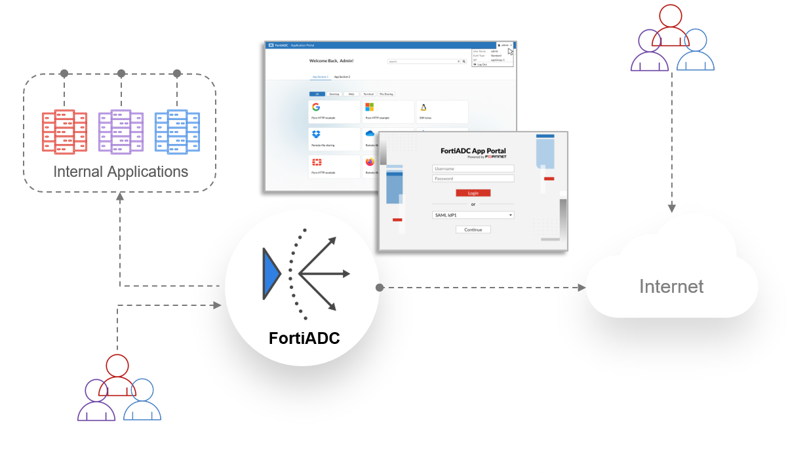

### This is a list of new features and/or changes in a given version

---

## 8.0.0

### Application Access Gateway (AAG)

**Key Features and Benefits**
- AAG in FortiADC delivers secure and scalable remote access with the following capabilities:
- Agentless Access – Eliminates the need for client-side agents, reducing endpoint dependency and administrative burden.
- Federated Authentication Support – Supports SAML 2.0-based authentication using providers like Microsoft Entra ID and FortiAuthenticator.
- Simplified Deployment – Requires no software installation, enabling rapid implementation in secure environments.
- Real-Time Monitoring – Tracks user sessions and access logs for compliance and auditing.
- Application-Layer Security Controls – Enforces IP reputation filtering and geolocation restrictions through the Application Profile attached to the AAG Virtual Server.

**Supported Application Types in FortiADC AAG:**
- Web RDP – Provides full desktop access via Remote Desktop Protocol (RDP) through an HTML5 browser session. No RDP client is required on the endpoint.
- Native RDP – Enables traditional RDP access using the native RDP client installed on the user's device. Requires endpoint support for Microsoft RDP.
- RemoteApp – Launches individual Windows applications published via Remote Desktop Services, rather than a full desktop session.
- Web VNC – Offers browser-based access to VNC-enabled systems for remote control of graphical desktops.
- Web SSH – Delivers secure command-line access to Linux and Unix systems through a browser-based SSH terminal.
- Web Telnet – Enables text-based terminal sessions to legacy devices or servers using the Telnet protocol, directly within the browser.

