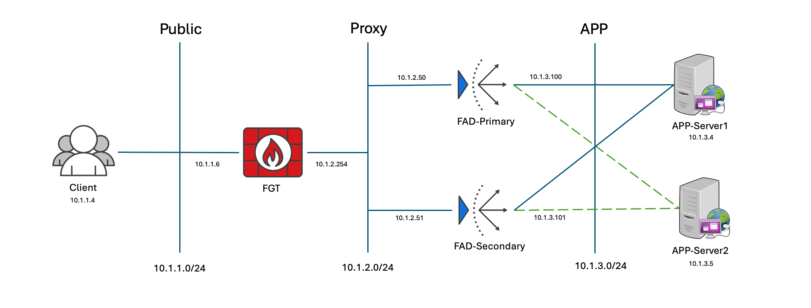
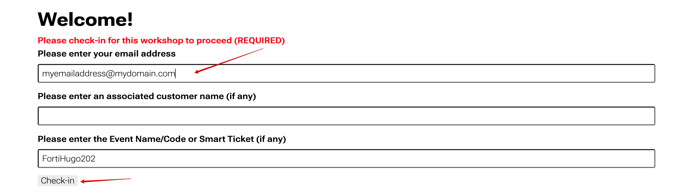
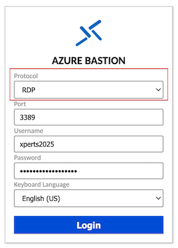
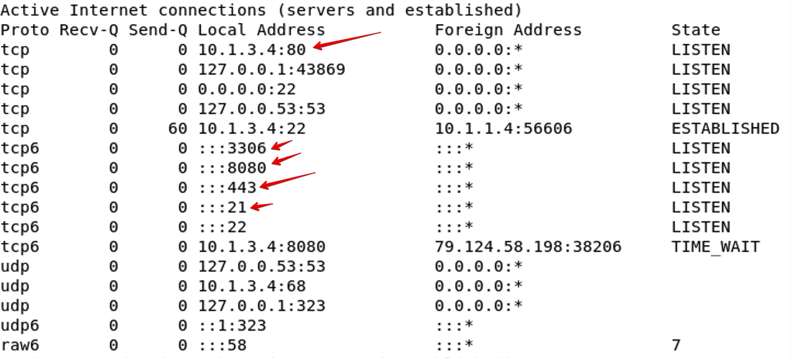
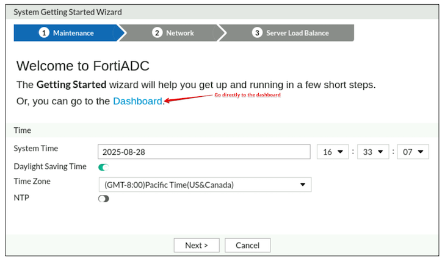
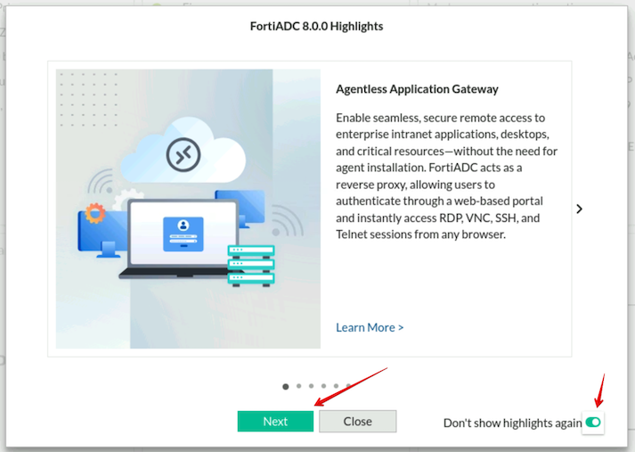

### **Network Diagram**



### **Lab Registration**

To begin, enter your email address and click Check-in.  Leave everything else as default.



### **Lab Access**

There are two possible ways to access this lab. Depending on the environment you will use one, or the other, or both.
- Azure Bastion Host
- RDP or SSH access to public IP's

### **Lab Access - Azure Bastion Host**

Your instructor will give you a link at the start of the lab that will give you access via RDP to the Linux Client.  From the Linux Client you will have SSH or Web access to all devices in the lab.  Switch the protocol from SSH to RDP to get started.



Log in with username ```xperts2025``` and password ```AppSec-Xp3rts2025!```        

### **Lab Access - RDP**

Most, if not all access will be done through an RDP connection to a Linux Client with a public IP.  Your instructor will give you the public IP at the start of the lab.

Once you have the public IP to your Client you will log in with username: ```xperts2025``` and password: ```AppSec-Xp3rts2025!```.  From the client you should have web or ssh access to all the devices in the lab.  There are bookmarks and passwords pre-loaded into Firefox for easy access to FAD-Primary, FAD-Secondary, Juicshop, and DVWA.

> [!Info]
> Note: The bookmarks for Juiceshop and DVWA won't work until the FortiADC's are configured.

### **Device Info**

| Device        |Username|Password| Public | Proxy     | APP        |
|---------------|-----|--------|--|-----------|------------|
| Client        |```xperts2025```|```AppSec-Xp3rts2025!```| 10.1.1.4 |           |            |
| FAD-Primary   |```xperts2025```|```AppSec-Xp3rts2025!```|  | 10.1.2.50 | 10.1.3.100 |
|               |admin|```AppSec-Xp3rts2025!```|  |           |            |
| FAD-Secondary |```xperts2025```|```AppSec-Xp3rts2025!```|  | 10.1.2.51 | 10.1.3.101 |
|               |admin|```AppSec-Xp3rts2025!```|  |           |            |
|FGT-1|```xperts2025```|```AppSec-Xp3rts2025!```| 10.1.1.6 |           |            |
|APP-Server1|```xperts2025```|```AppSec-Xp3rts2025!```|  |           | 10.1.3.4   |
|APP-Server2|```xperts2025```|```AppSec-Xp3rts2025!```|  |           | 10.1.3.5   |
|DVWA|admin|```password```||||

> [!Info]
> The Juiceshop and DVWA applications need to be started on the application servers using the following commands.  If we miss this step our health checks will fail.

**APP-Server1**

From the Client, SSH into APP-Server1 at 10.1.3.4.
```
ssh xperts2025@10.1.3.4
```
Password: ```AppSec-Xp3rts2025!```

Start DVWA and Juiceshop 
```
sudo /opt/lampp/lampp start
sudo docker run -d -p 10.1.3.4:80:3000 bkimminich/juice-shop
```
Run netstat to confirm the applications are running.

```
nestat -an | less
```
Your output should look like the image below.  Now we see the server is listening on ports 80, 443, 8080, 21 and 3306.  We could use any of these ports for our health checks.



To quit netstat type "q".

To exit the application server type "exit".

> [!Info]
> Note: If you need to clear the ssh keys try:
> 
> ```ssh-keygen -f "/home/xperts2025/.ssh/known_hosts" -R "10.1.3.4"```
> or
> ```ssh -o StrictHostKeychecking=no hostname```

**APP-Server2**

From the Client, SSH into APP-Server2 at 10.1.3.5.
```
ssh xperts2025@10.1.3.5
```
Password: ```AppSec-Xp3rts2025!```

Start DVWA and Juiceshop 
```
sudo /opt/lampp/lampp start
sudo docker run -d -p 10.1.3.5:80:3000 bkimminich/juice-shop

```
Run netstat to confirm the applications are running.

```
nestat -an | less
```

Your output should look like the image below.  Now we see the server is listening on ports 80, 443, 8080, 21 and 3306.  We could use any of these ports for our health checks.


To quit netstat type "q".

To exit the application server type "exit".

> [!Info]
> Note: If you need to clear the ssh keys try:
> 
> ```ssh-keygen -f "/home/xperts2025/.ssh/known_hosts" -R "10.1.3.5"```
> or
> ```ssh -o StrictHostKeychecking=no hostname```

### **First Time Access to the FortiADC**

If you see the Getting Started wizard click Dashboard.  This will take you directly to the Dashboard, bypassing the wizard.



If you see the Highlights wizard click "Next" while scrolling through the latest highlights, toggle "Don't show highlights again" and click "Close".




