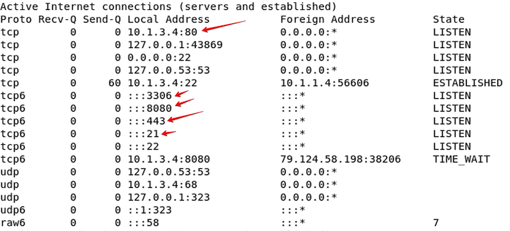

### **Network Diagram**


### **Device Info**

| Device        |Username|Password| Public | Proxy     | APP        |
|---------------|-----|--------|--|-----------|------------|
| Client        |```xperts2025```|```AppSec-Xp3rts2025!```| 10.1.1.4 |           |            |
| FAD-Primary   |```xperts2025```|```AppSec-Xp3rts2025!```|  | 10.1.2.50 | 10.1.3.100 |
|               |admin|```AppSec-Xp3rts2025!```|  |           |            |
| FAD-Secondary |```xperts2025```|```AppSec-Xp3rts2025!```|  | 10.1.2.51 | 10.1.3.101 |
|               |admin|```AppSec-Xp3rts2025!```|  |           |            |
|FGT-1|```xperts2025```|```AppSec-Xp3rts2025!```| 10.1.1.6 |           |            |
|APP-Server1|```xperts2025```|```AppSec-Xp3rts2025!```|  |           | 10.1.3.4   |
|APP-Server2|```xperts2025```|```AppSec-Xp3rts2025!```|  |           | 10.1.3.5   |
|DVWA|admin|```password```||||

> [!Info]
> The Juiceshop and DVWA applications need to be started on the application servers using the following commands.  If we miss this step our health checks will fail.

**APP-Server1**

From the Client, SSH into APP-Server1 at 10.1.3.4.
```
ssh xperts2025@10.1.3.4
```
Password: ```AppSec-Xp3rts2025!```

Start DVWA first
```
sudo /opt/lampp/lampp start
```

Start Juiceshop second.

```
sudo docker run -d -p 10.1.3.4:80:3000 bkimminich/juice-shop
```

**APP-Server2**

From the Client, SSH into APP-Server2 at 10.1.3.5
```
ssh xperts2025@10.1.3.5
```
Password: ```AppSec-Xp3rts2025!```

Start DVWA first
```
sudo /opt/lampp/lampp start
```

Start Juiceshop second.

```
sudo docker run -d -p 10.1.3.5:80:3000 bkimminich/juice-shop
```
To verify the applications are running.  From the Client, SSH into both and run the command:
```
netstat -an | less
```
You should see the listening ports for DVWA and Juiceshop.  Juiceshop is listening on TCP port 80, and DVWA is listening on TCP ports 21, 443, 8080, and 3306.




