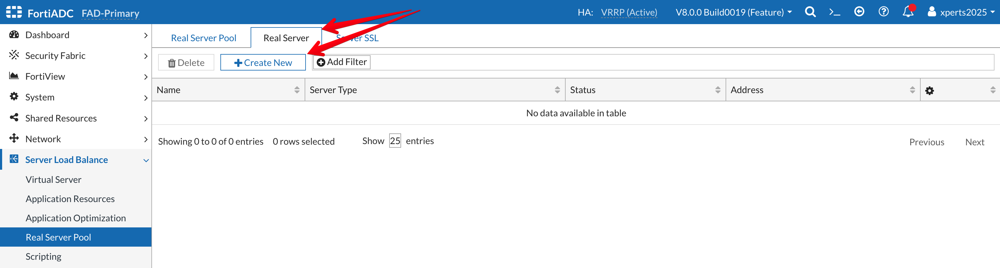
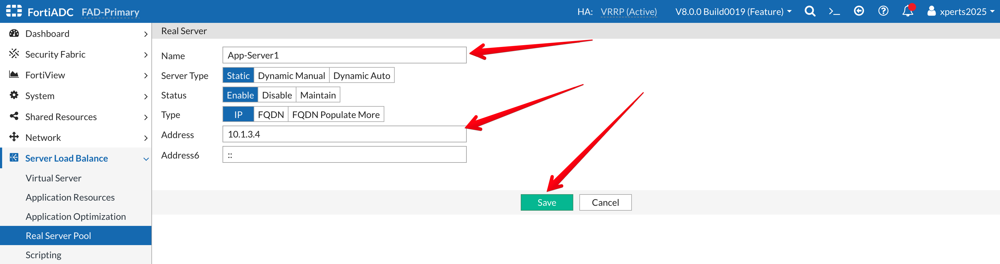
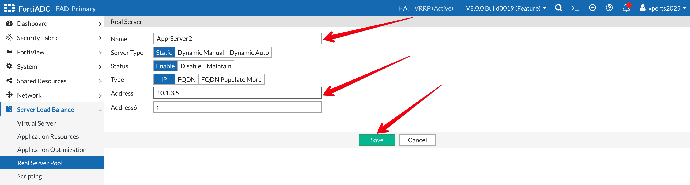
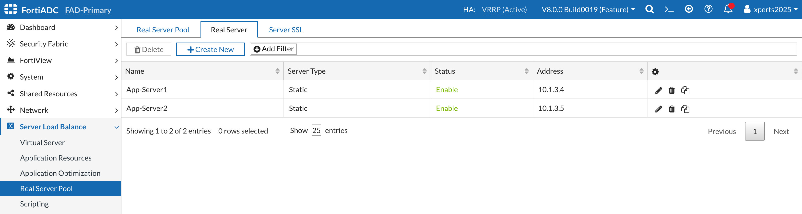

### **Real Servers**

In this section we will define two application servers. 
- Login to the FortiADC with username ```admin``` and password ```fortinet```
- Go to **Server Load Balance → Real Server Pool**
- Click on the **Real Server** Tab 
- Click on **+Create New**



- Name: **APP-Server1**
- Server Type: **Static**
- Status: **Enable**
- Type: **IP**
- Address: **10.1.3.4**
- **Save**



We will repeat the same steps as above to add the second application server. 

- Name: **APP-Server2**
- Server Type: **Static**
- Status: **Enable**
- Type: **IP**
- Address: **10.1.3.5**
- **Save**



Your final result should look like the image below 



In the above example, we used IP addresses to define the real servers. However, we also have additional mechanisms, such as FQDN, to define the real servers. Additionally, the server status can be set to "disabled" to ensure FortiADC will not send traffic to the server, or it can be put in "maintenance mode" to allow current sessions to continue while preventing new sessions from being sent to the server. Please refer to the user guide for additional details.