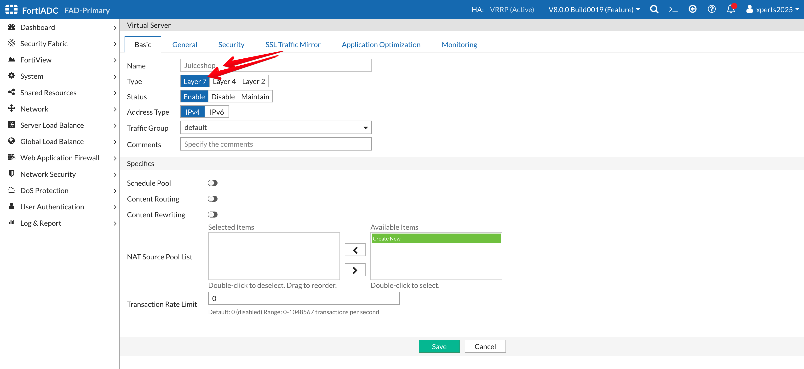
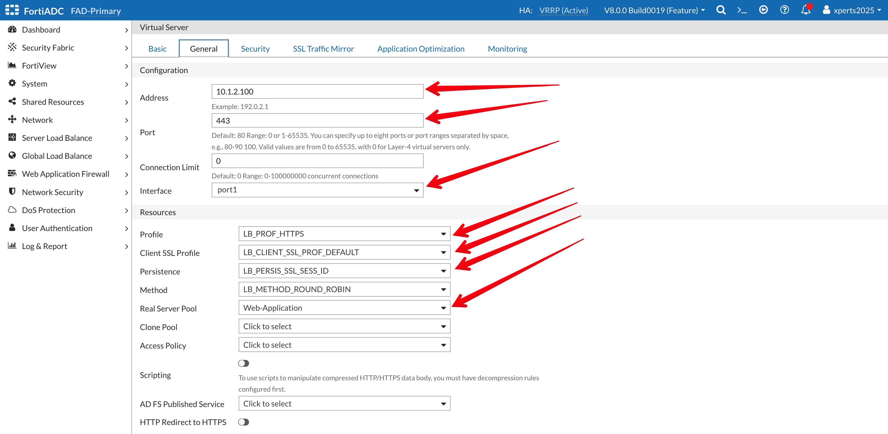
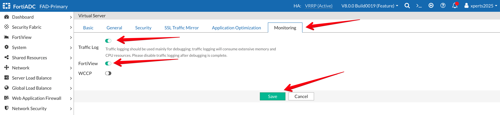
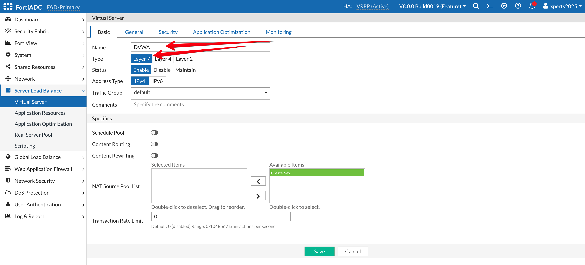
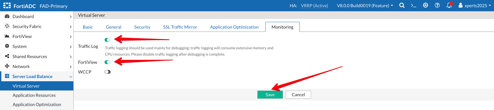

### **Define Virtual Servers**

The next step is to configure a virtual server, which defines the type of traffic FortiADC will manage and how it will be processed. For this exercise, we will create two virtual servers, one for each of our web applications, while using the default settings wherever possible.
- Login to the FortiADC (FAD-Primary) with username ```xperts2025``` and password ```AppSec-Xp3rts2025!```
- Go to **Server Load Balance → Virtual Server**
- Click on **+Create New** then **Advanced Mode**


- Name: **Juiceshop**
- Type: **Layer 7**



- Go to the **General** Tab 
- Address: **10.1.2.100**
- Port: **443**
- Interface: **Port1** ( from the dropdown Menu) 
- Profile: **LB_PROF_HTTPS**
- Client SSL Profile: **LB_CLIENT_SSL_PROF_DEFAULT**
- Persistence: **LB_PERSIS_SSL_SESS_ID**
- Method: **LB_METHOD_ROUND_ROBIN**
- Real Server Pool: **Web-Application**



- Go to the **Monitoring** Tab
- **Traffic Log:** Enable the Toggle
- **FortiView:** Enable the Toggle
- **Save**



- Go to **Server Load Balance → Virtual Server**
- Click on **+Create New** then **Advanced Mode**


- Name: **DVWA**
- Type: **Layer 7**



- Go to the **General** Tab 
- Address: **10.1.2.101**
- Port: **443**
- Interface: **Port1** (from the dropdown Menu) 
- Profile: **LB_PROF_HTTPS**
- Client SSL Profile: **LB_CLIENT_SSL_PROF_DEFAULT**
- Persistence: **LB_PERSIS_SSL_SESS_ID**
- Method: **LB_METHOD_ROUND_ROBIN**
- Real Server Pool: **DVWA**


- Go to the **Monitoring** Tab
- **Traffic Log:** Enable the Toggle
- **FortiView:** Enable the Toggle
- **Save**



- Go to **FortiView → Logical Topology** 

Your topology should look like the image below 

