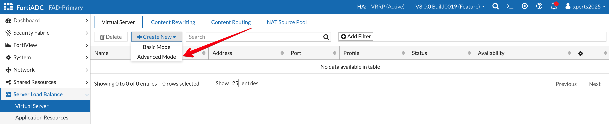

### **Define Virtual Server**

The next step is to configure a virtual server, which defines the type of traffic FortiADC will manage and how it will be processed. For this exercise, we will create two virtual servers, one for each of our web applications, while using the default settings wherever possible.

- Go to **Server Load Balance/Virtual Server**
- Click on **+Create New** then **Advanced Mode**

### **NAT Source Pools**

