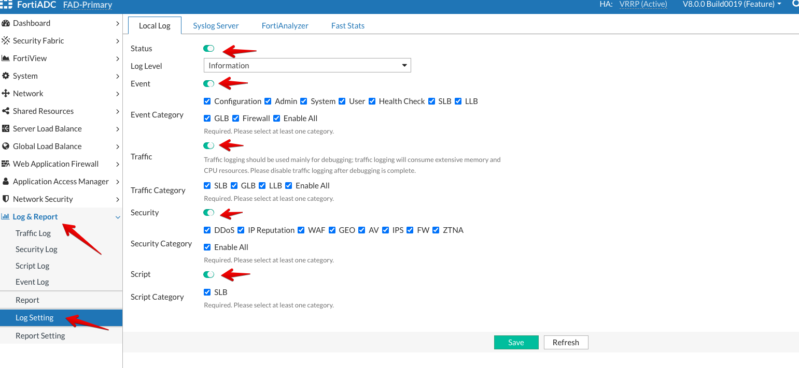

### **Log Settings**

The local log is a datastore hosted on the FortiADC system. In this step, we are going to turn on all the Logs like Event logs, Traffic logs, Security logs and Script logs.

To configure local log settings:

* Access Primary FortiADC's GUI from the console using the link provided
* Login to the FortiADC with the username ```admin``` and password ```fortinet```
* Go to **Log & Report** → **Log Setting**
* Select to enable local logging **Status**.
* Then, select **Enable All** option under all the log categories.
* Click **Save**

