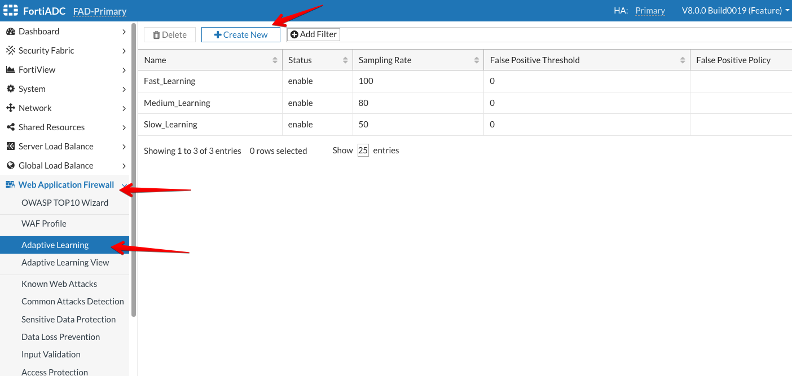
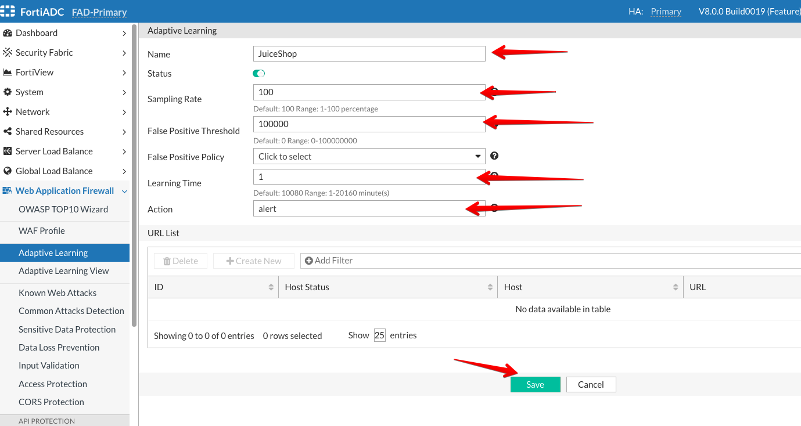
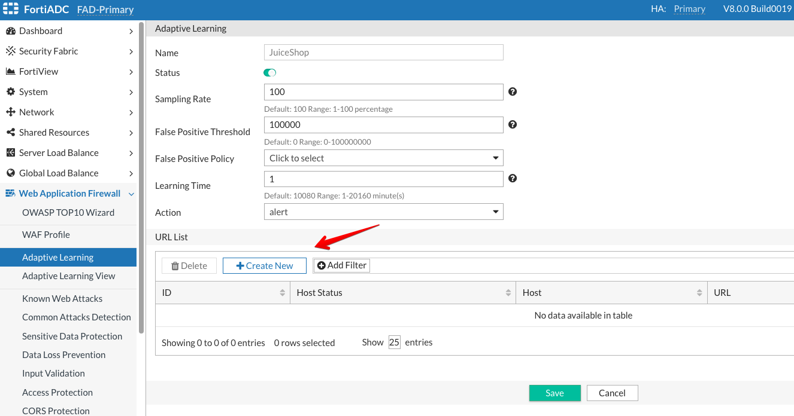
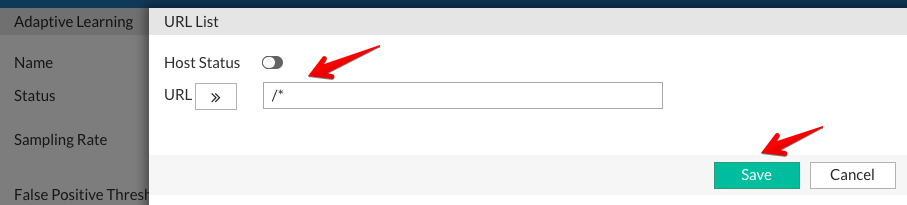
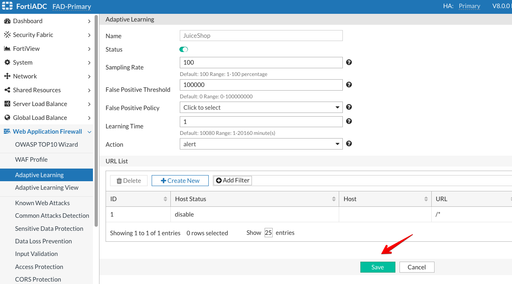
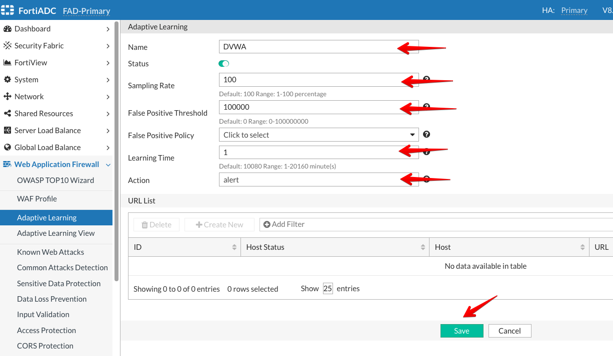
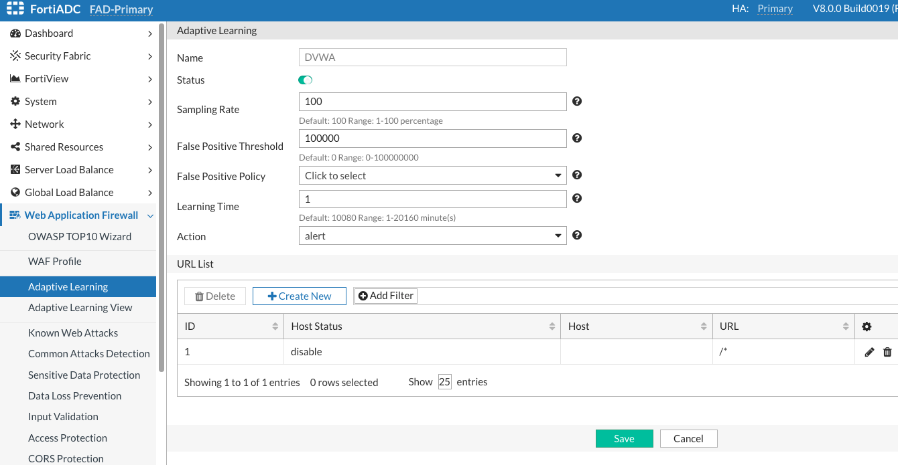
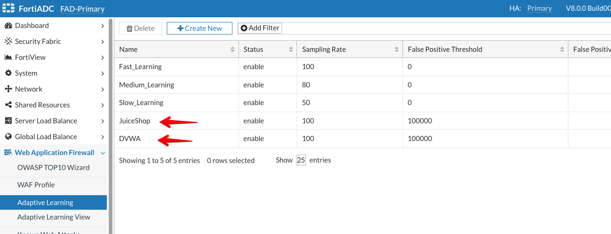

### Adaptive Learning - Configuration 

The configuration steps will be as follows:

1. Create Adaptive learning profile 
2. Create WAF profile and add the Adaptive learning profile created in step 1
3. Associate the WAF profile with the virtual server created in Section one of the lab. 


### Step 1 - Create Adaptive learning profile
* Access Primary FortiADC's GUI from the console using the link provided
* Login to the FortiADC with the username ```xperts2025``` and password ```AppSec-Xp3rts2025!```
* Go to **Web Application FireWall** → **Adaptive learning**
* Click on **+Create New** 



* Name: ```JuiceShop```
* Status: **Enable** the toggle
* Sampling Rate: ```100```
* False Positive Threshold: ```100000```
* Learning Time: ```1```
* Click **Save**

  
 
* After that, click on the **+Create New** button to create a **URL LIST** 



* On the URL List page, type **/*** under URL textbox
* Click **Save**
* Click **Save** again






**We will repeat the same steps for the second application**

* Name: ```DVWA```
* Status: **Enable** the toggle
* Sampling Rate: ```100```
* False Positive Threshold: ```100000```
* Learning Time: ```1```
* Click **Save**



* After that, click on the **+Create New** button to create a **URL LIST** 

* On the URL List page, type **/*** under URL textbox
* Click **Save**
* Click **Save** again




* After adding them, the Adaptive Learning page should look like this:

