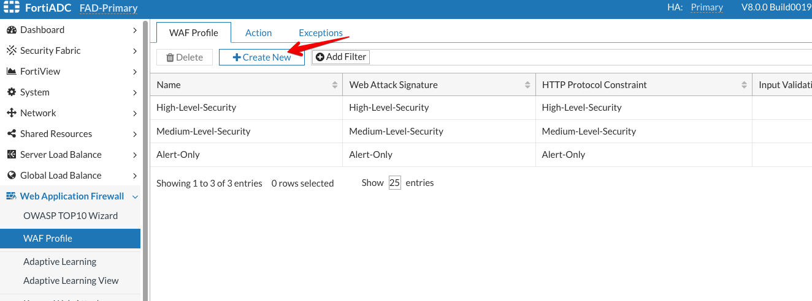
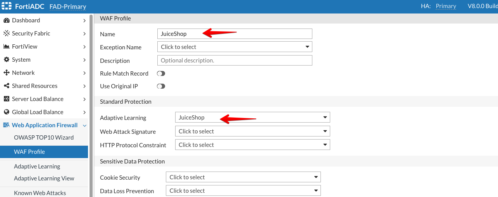
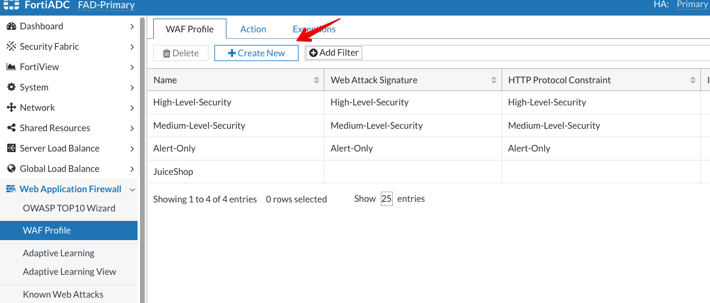
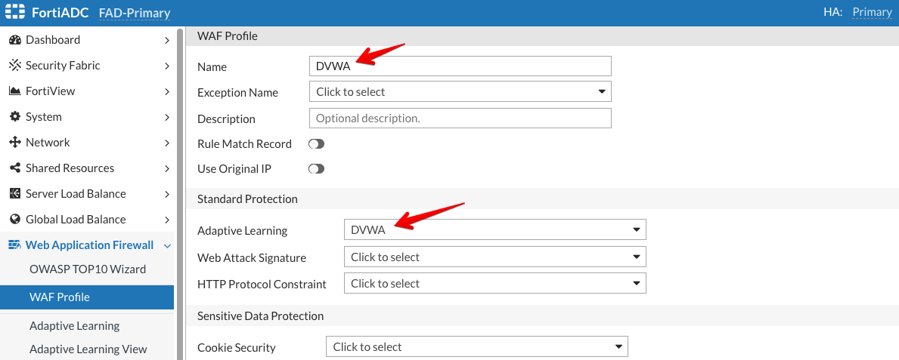
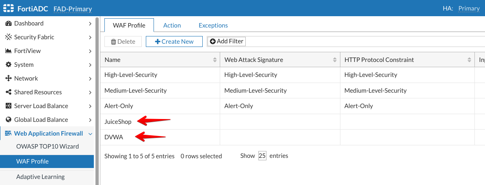

### Step 2 - Create WAF profile 

Now, we will create a WAF profile and associate the Adaptive Learning profiles (JuiceShop & DVWA) we created with the WAF profile. 

* Access Primary FortiADC's GUI from the console using the link provided
* Login to the FortiADC with the username ```xperts2025``` and password ```AppSec-Xp3rts2025!```
* Go to **Web Application FireWall** → **WAF Profile**
* Click on **+Create New** 



* Name: `JuiceShop`
* Adaptive Learning: Select **JuiceShop** from the dropdown
* Click **Save**




* For this exercise, we will focus solely on configuring the adaptive learning module and will not configure the other WAF modules. In a production environment, however, all relevant WAF modules would be configured as needed to ensure comprehensive protection.

* After that, we will create a second WAF profile for the DVWA application

* Go to **Web Application FireWall** → **WAF Profile**
* Click on **+Create New** 



* Name: `DVWA`
* Adaptive Learning: Select **DVWA** from the dropdown
* Click **Save**



* After adding them, the WAF Profile page should look like this:



