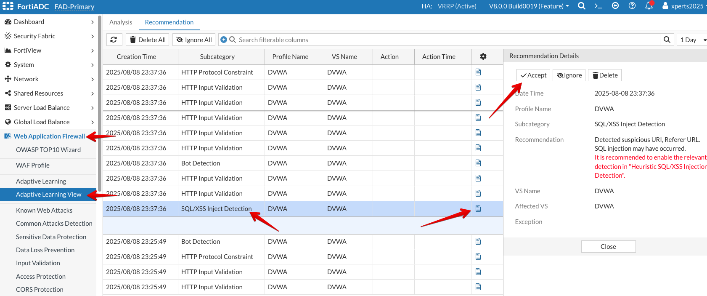

### Testing Adaptive Learning

For this section, we will use scripts that we will run on the client machine to generate traffic and to simulate attacks using **ZAP tool**.

* Access Primary FortiADC's GUI from the console using the link provided
* Login to the FortiADC with the username ```admin``` and password ```fortinet```
* First, we need to clear all the logs from FortiADC. 
* To do that, go to FortiADC CLI by clicking ">_" towards the top right corner and type ```execute log delete-type all```


* Go to **Web Application Firewall** → **Adaptive Learning View** and delete all Recommendations as shown below.


* Go to **Web Application Firewall** → **Adaptive Learning View** and delete all Analysis data as shown below.
 


* RDP to the client machine with the username ```xperts2025``` and password ```AppSec-Xp3rts2025!```
* Click on **Activities** on top left corner and open **Terminal**


* Run ```sudo ./load-test.sh``` and let it run until it's finished (about 2 minutes).


* Go back to FortiADC console and click **Web Application Firewall** → **Adaptive Learning View** and observe the Adaptive Learning data under **Analysis** and **Recommendation**.
* Expand the **DVWA** tab and observe the different directories detected by Adaptive Learning.


* Go back to RDP connection to the Client, click on **Activities** on top left corner and open **Firefox** and using the bookmark go to **DVWA**


* Login to **DVWA** app with the username ```admin``` and password ```fortinet```


* Go to **XSS (Reflected)** from the left menu and insert an SQL Injection twice, ```'+OR+1=1--``` and ```' OR 'x'='x```


* Give it a couple of minutes to run its analysis and log the new recommendations.
* Go back to FortiADC console and click **Web Application Firewall** → **Adaptive Learning View** and observe the Adaptive Learning data under **Analysis** and **Recommendation**.
* There should be various WAF Recommendations including HTTP Input Validation, HTTP Protocol Constraint, and SQL/XSS Inject Detection.


* Accept the **Recommendations** and repeat the above step for all the recommendations.



* Review the config changes by the Adaptive Learning. We can see from the below screenshots, that once we accepted the recommendations from Adaptive Learning, it was added to WAF profile's modules like **HTTP Protocol Constraint**, **SQL/XSS Injection Detection** and **Bot Detection**.


####### May be add running the ZAP tool now or later after Bot Mitigation & DDOS modules.