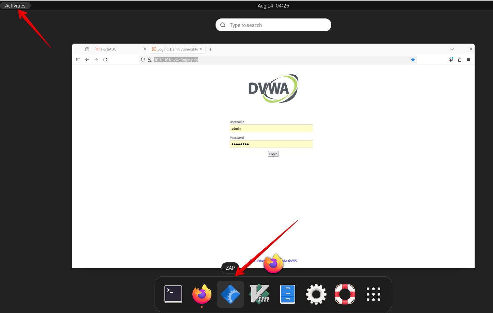
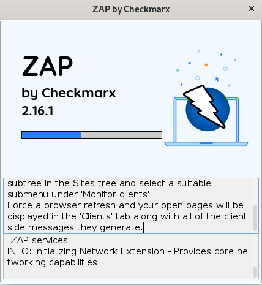
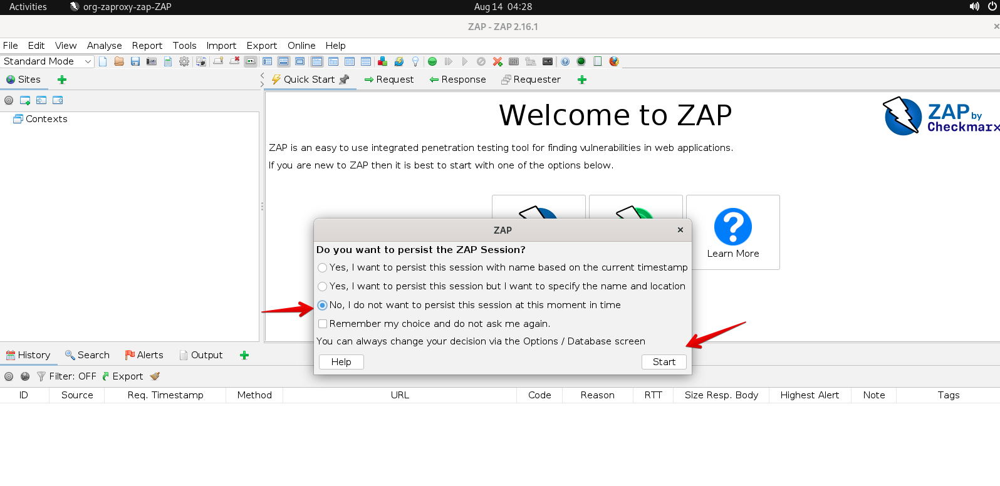
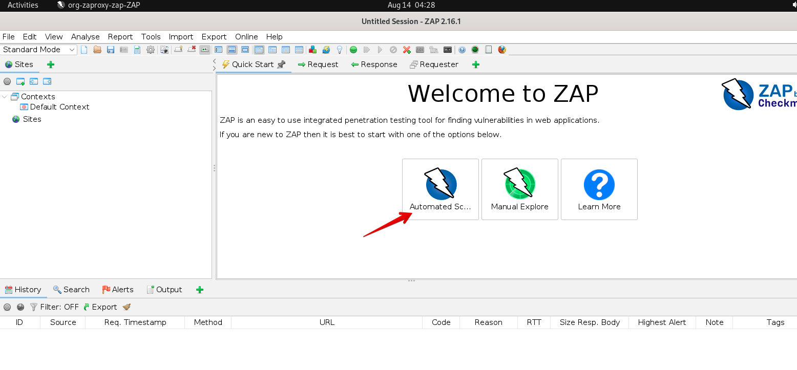
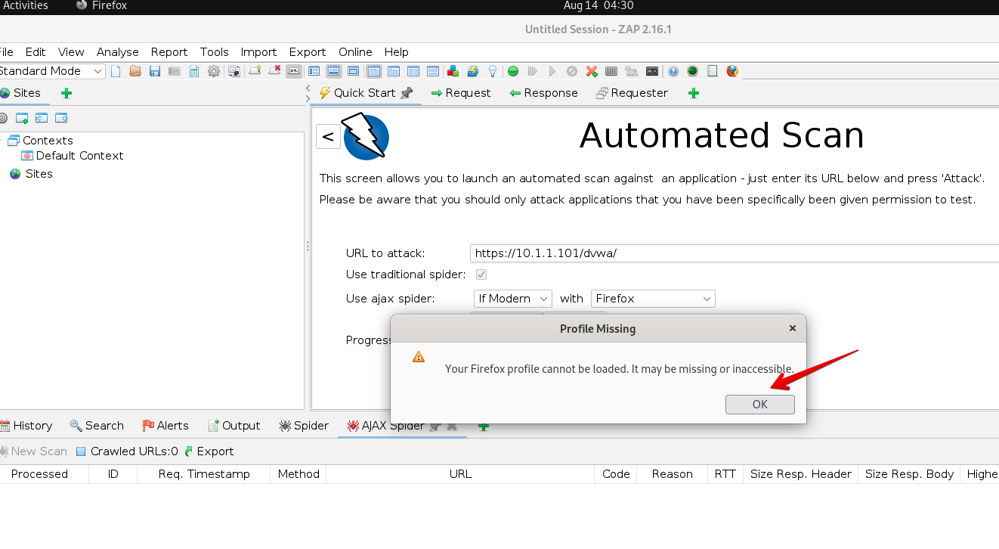

### Testing WAF

For this section, we will simulate attacks using **ZAP tool** installed on the Client machine.

* RDP to the client machine with the username ```xperts2025``` and password ```AppSec-Xp3rts2025!```
* Click on **Activities** on top left corner and open **ZAP** tool.



* It will take few seconds for it to load on the Client machine. 



* **ZAP** tool will show a pop-up showing different options. Select the default one as shown below and click **Start**



* Click **Automated Scan** option shown as below. 



* Enter ```https://10.1.1.101/dvwa/``` under **URL to attack:** textbox and keep everything default and click **Attack**. 


* **ZAP** tool will show a pop-up showing **Your Firefox profile cannot be loaded. It may be missing or inaccessible.**. Click **OK**.



* **ZAP** tool will show the progress of the attack under **Active Scan** tab as shown below. It shows all the different requests **ZAP** tool is making on several URLs as shown below. Let it run until it's finished (few minutes).


* Access Primary FortiADC's GUI from the console using the link provided
* Login to the FortiADC with the username ```xperts2025``` and password ```AppSec-Xp3rts2025!```
* Go to **Log & Report** → **Security Log**. It will show all the **Attacks** coming in from the **ZAP** tool hitting **DVWA** webserver behind **FortiADC**. 


