### Bot Mitigation

For this section, we will focus on following Bot Mitigation modules of FortiADC's Web Application Firewall to protect webservers from Bot automated attacks:

* Configuring a Bot Detection Policy
* Configuring a Threshold Based Detection Policy
* Configuring a Biometrics Based Detection Policy
* Configuring a Fingerprint Based Detection Policy

### Configuring a Bot Detection Policy

* Bot Detection policies employ signature analysis and behavioral tracking to identify client traffic likely generated by automated bots rather than genuine human users. Legitimate bots, such as search engine crawlers, are classified as "good bots" because they perform essential search indexing operations, which can increase the visibility of your site to legitimate users.

* Conversely, "bad bots" are known to generate malicious traffic that can compromise site availability and integrity. Examples of such activities include Distributed Denial of Service (DDoS) attacks and content scraping. To mitigate these threats, it is crucial to deploy effective bot mitigation strategies, such as IP reputation analysis, rate limiting, anomaly detection algorithms, and CAPTCHA challenges, to identify and block these harmful bots in real-time.

* Access Primary FortiADC's GUI from the console using the link provided
* Login to the FortiADC with the username ```admin``` and password ```fortinet``` 
* Go to **Web Application Firewall** → **Bot Detection** 
* You will notice that since we accepted the recommendations from Adaptive Learning, it was automatically added to **Bot Detection** module so we don't need to create a new one.

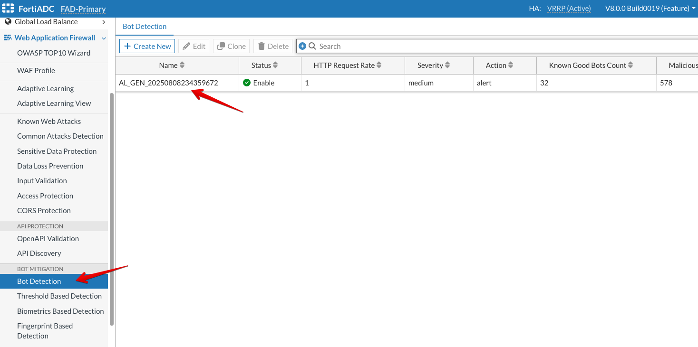

### Configuring a Threshold Based Detection Policy

* Go to **Web Application Firewall** → **Threshold Based Detection policy** 
* You will notice several policies which comes by default with FortiADC. You can use these but you cannot customize them. So, we will create a new one below. 
* Click on **+Create New** 

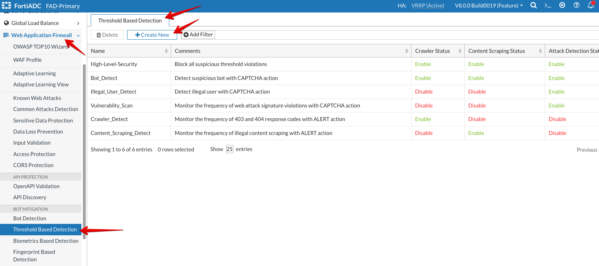

* Name: ```Threshold-Based-Detection-Policy```
* **Enable** the toggle for **Crawler Status**
* Response Code: ```403,404```
* Keep everything default under **Crawler Status**

* **Enable** the toggle for **Content Scraping Status**
* Select all under **Content Type**
* Keep everything default under **Crawler Scraping Status**

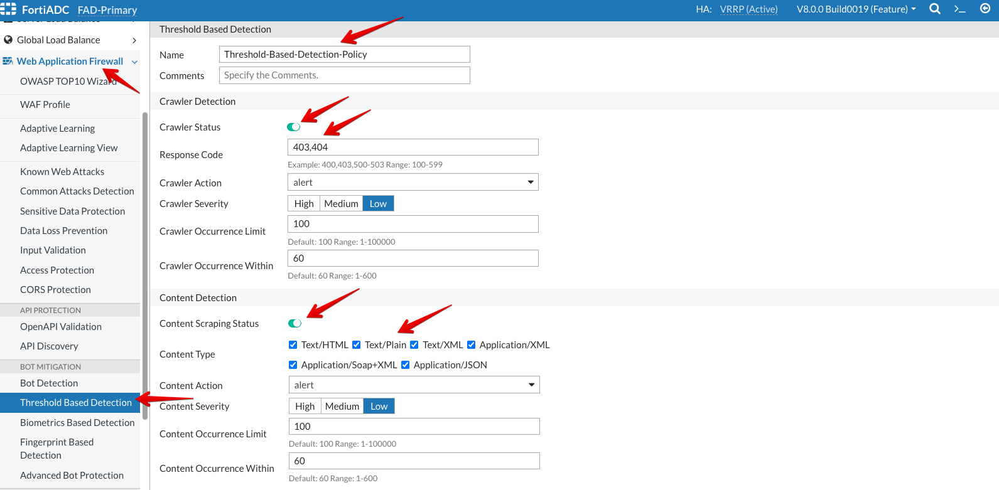

* **Enable** the toggle for **Attack Detection Status**
* Select all under **Attack Modules**
* Keep everything default under **Attack Detection**
* Click **Save**

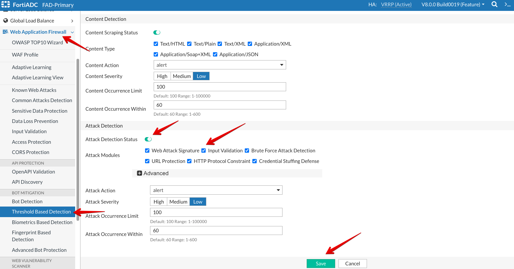

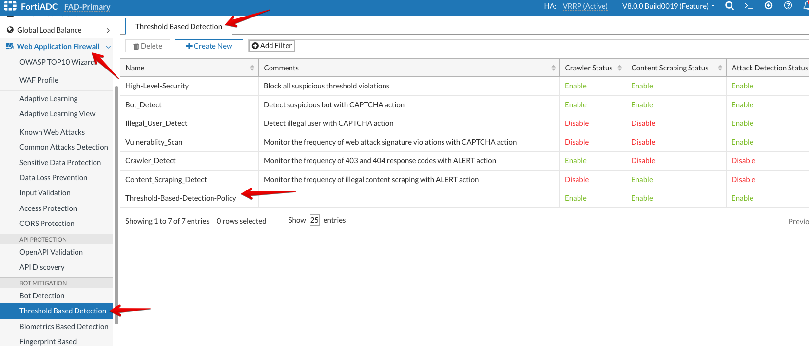

### Configuring a Biometrics Based Detection Policy

* Go to **Web Application Firewall** → **Biometrics Based Detection** 
* Click on **+Create New** 

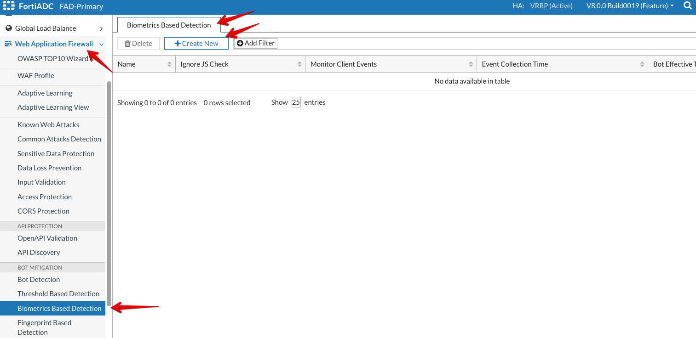

* Name: ```Biometrics-Based-Detection-Policy```
* Keep everything default.
* Click **Save**

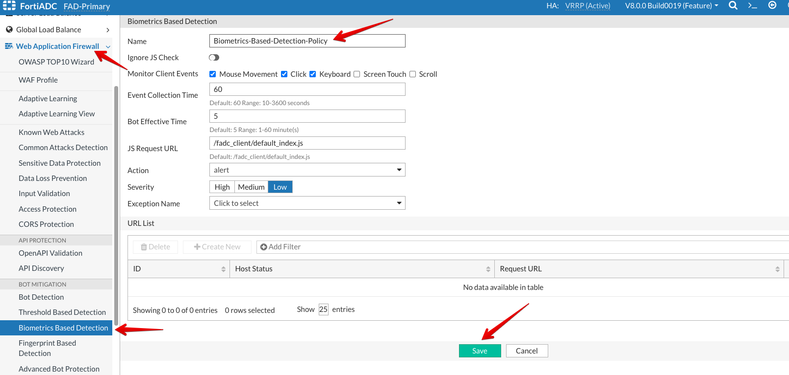

* Click on **+Create New** 

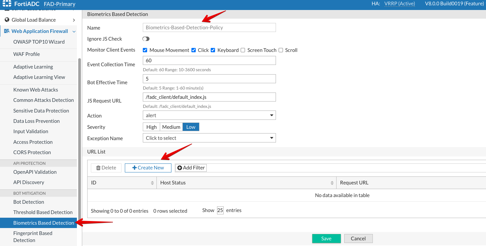

* Under Request URL, type ```/.*``` 
* Click **Save**

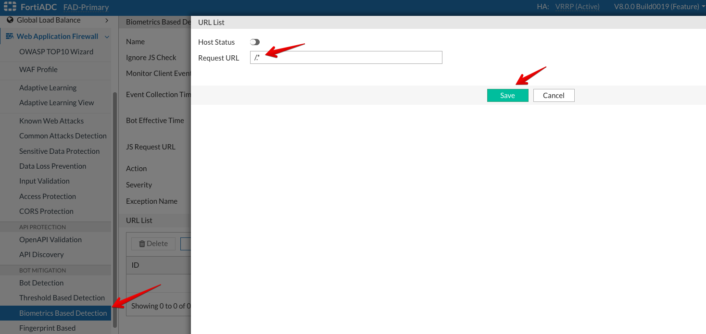

* Click **Save** once more.

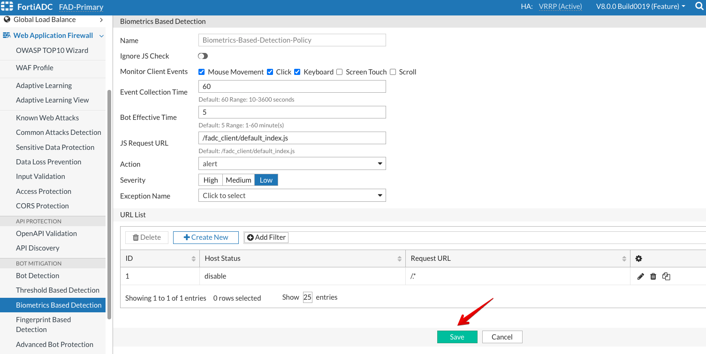

### Configuring a Fingerprint Based Detection Policy

* Go to **Web Application Firewall** → **Fingerprint Based Detection Policy** 
* Click on **+Create New** 

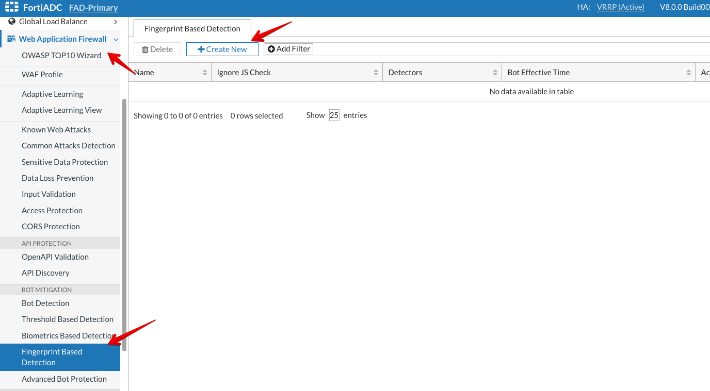

* Name: ```Fingerprint-Based-Detection-Policy```
* Keep everything default.
* Click **Save**

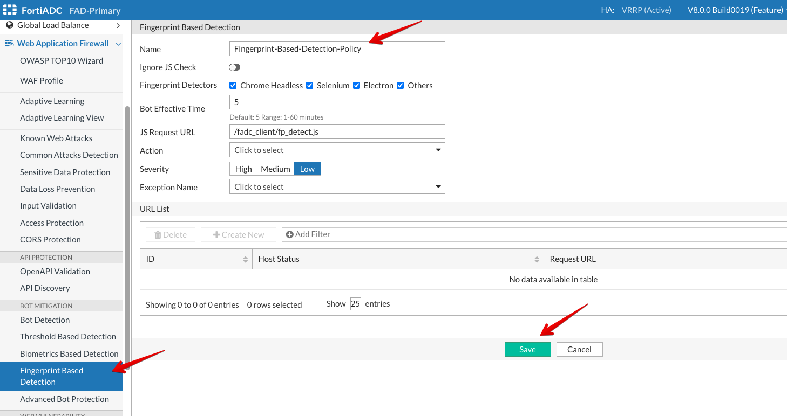

* Click on **+Create New**

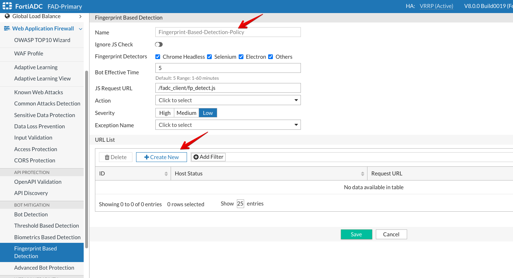

* Under Request URL, type ```/.*``` 
* Click **Save**

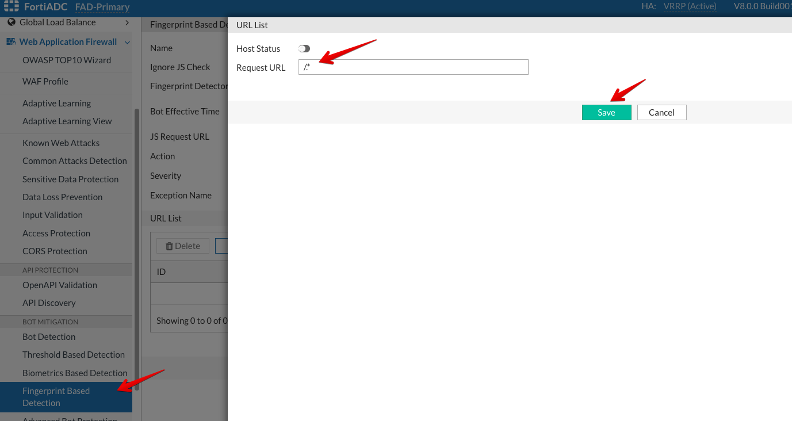

* Click **Save** once more.

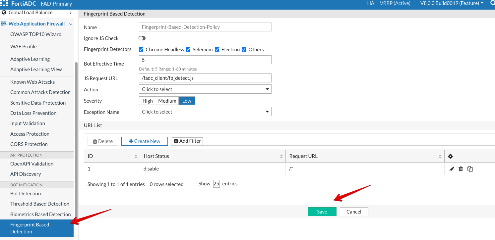

### Configuring DVWA WAF Profile with Bot Mitigation Modules

* Now, we will add the Bot Mitigation Modules to **DVWA** WAF Profile.
* Double click **DVWA**

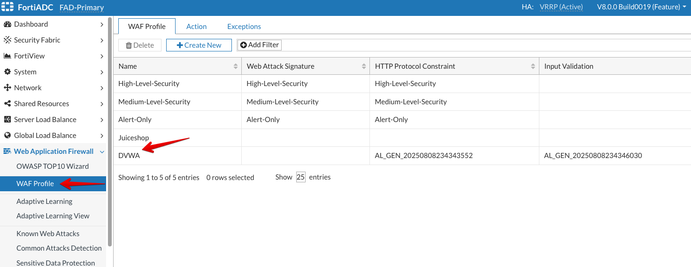

* Select the highlighted Bot Mitigation modules from the respected dropdowns and click **Save**.

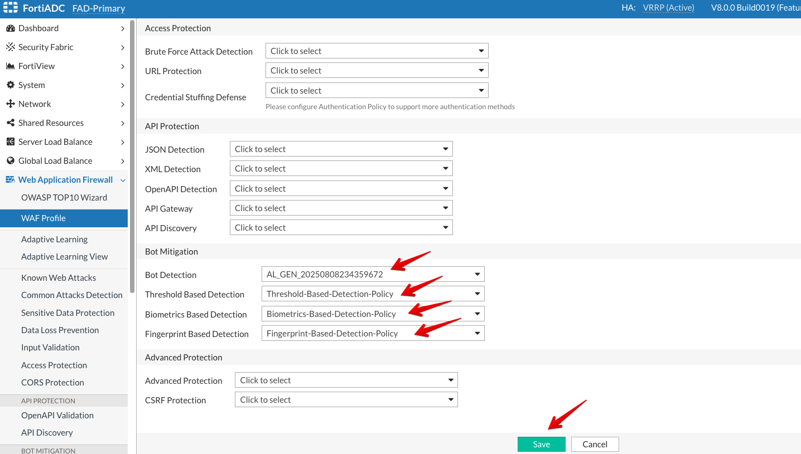