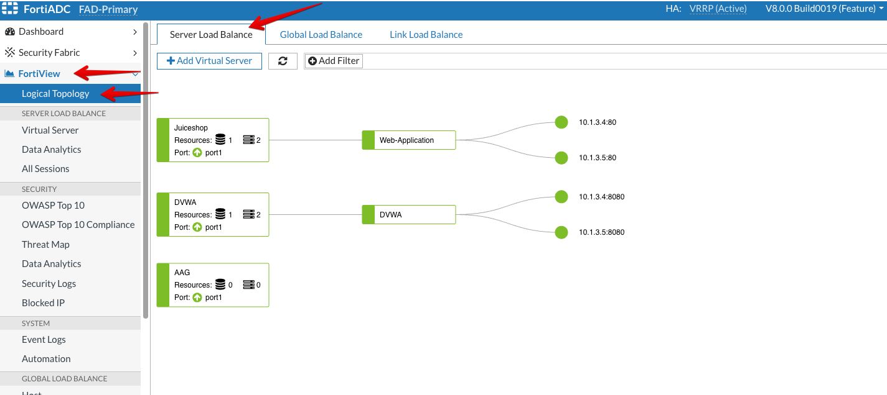
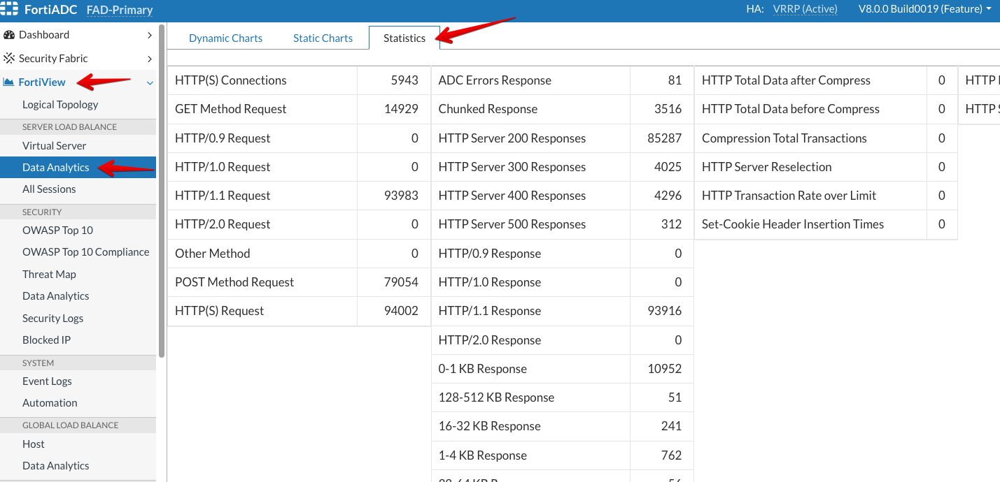
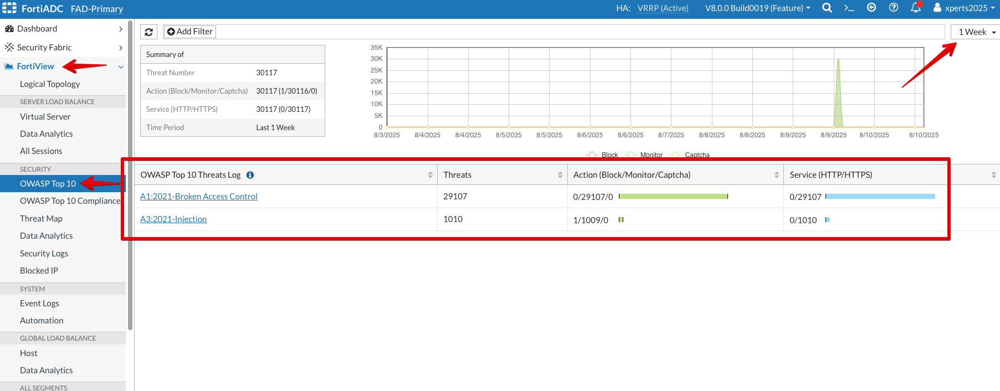

### Logs and Dashboard

For this section, we will look at different types of logs and dashboards.

* Access Primary FortiADC's GUI from the console using the link provided
* Login to the FortiADC with the username ```xperts2025``` and password ```AppSec-Xp3rts2025!```
* We will look at the logical topology of FortiADC network structure showing FortiADC's Virtual Servers, Server Pools and Real Servers under the respective Server Pools. 
* Click **FortiView** and then, select **Logical Topology** and you will be able to see Virtual Servers under **Server Load Balance** tab. 
* From the below screenshot, we can see both **Juiceshop** and **DVWA** Virtual Servers.



* Now, we will look at the **Statistics** status of the whole VDOM. For that, go to **FortiView** → **Data Analytics** under **Server Load Balance** tab.
* We can see details about number of **HTTP(S) Connections**, number of **GET** or **POST** method requests, **HTTP Server Response codes** like 200, 400, 500  etc. 



* Through the **FortiView** → **OWASP Top 10** page, we can monitor threats by OWASP Top 10 to analyze the 10 most critical attacks targeted to our application upto 1 week. 

