### **Configuring an App Group**

An App Group is a logical container that organizes application bookmarks—each representing a backend resource such as an RDP host, SSH server, or internal web application. App Groups are assigned to App Portals, which define the user-facing interface through which authenticated users access their authorized applications.

Each App Group can contain bookmarks of various types (Web, RDP, SSH, VNC, etc.), and users accessing a given App Portal will only see the applications associated with its linked App Groups.

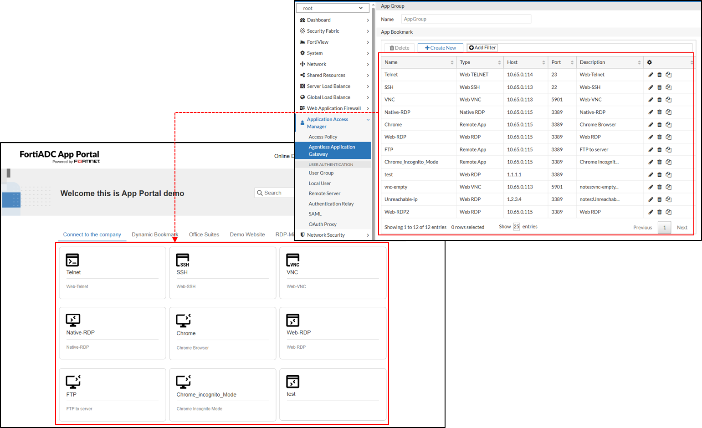

**To create an App Group:**

1. Navigate to Application Access Manager > Agentless Application Gateway.
The configuration page displays the App Portal tab.
2. Click the App Group tab.
3. Click Create New to display the configuration editor.
4. In the Name field, specify a unique name for the App Group configuration object. Valid characters are A-Z, a-z, 0-9, _, and -. No space is allowed.
5. Click Save.

Once the App Group is created, the App Bookmark section becomes configurable.
Each VDOM supports up to 1024 App Groups, but a single App Portal can be associated with a maximum of 32 App Groups.

### App Bookmark Configuration Overview

The App Bookmark configuration workflow is entirely dependent on the specific protocol. Each App Bookmark within an App Group is configured with application-specific parameters to ensure optimal access control and user experience. Once configured, an App Group can be added to an App Portal, making the applications available to authenticated users. The steps below outline the basic workflow to configure an App Bookmark.

1. Go to Application Access Manager > Agentless Application Gateway
The configuration page displays the App Portal tab.
2. Click the App Group tab.
3. Create a new App Group or edit an existing configuration.
4. Under the App Bookmark section, click Create New to display the configuration editor.
5. In the Name field, specify a unique name for the App Bookmark configuration object. Valid characters are A-Z, a-z, 0-9, _, and -. No space is allowed.
6. From the Type field, select an application from the drop-down menu. This selection determines the parameters to configure. To view the configuration parameters for each application, see [App Bookmark Types](https://docs.fortinet.com/document/fortiadc/8.0.0/administration-guide/539658/configuring-an-app-group#App_types) where you can navigate to the desired application type.
7. Click Save to save the configuration.
Repeat the steps to add up to 256 Bookmarks per App Group.

**App Bookmark Types**

Each App Bookmark Type requires specific parameters to be configured. The following table lists the supported Types and their usage. Use the links under the Application Type column to navigate to the configuration parameters applicable to each App Bookmark Type.

| Application Type | Usage                                                                  |
|------------------|------------------------------------------------------------------------|
|Web RDP|Provides web-based remote desktop access via an HTML5 client, eliminating the need for an RDP client on the user’s device.|
|Native RDP|Establishes a direct connection to an RDP server, requiring an installed RDP client on the user’s device.|
|Remote App|Enables access to specific Windows applications over RDP without exposing the full desktop session.|
|Web VNC|Grants browser-based access to remote desktops running Virtual Network Computing (VNC).|
|Web SSH|Allows command-line access to remote Linux or Unix servers via a secure, browser-based SSH session.|
|Web Telnet|Provides browser-based access to Telnet-enabled devices for legacy terminal access.|

**Note:** For application types that require login credentials—such as RDP, VNC, and SSH—you must specify a username and password within the App Group configuration. When cloning an App Group, all passwords are automatically cleared and must be re-entered manually to maintain secure handling.

**Web RDP**

Web RDP (Remote Desktop Protocol) provides web-based access to a remote Windows desktop session without requiring an RDP client. It allows users to connect to Windows systems securely through their browser, making it ideal for remote administration, virtual desktop access, and troubleshooting.

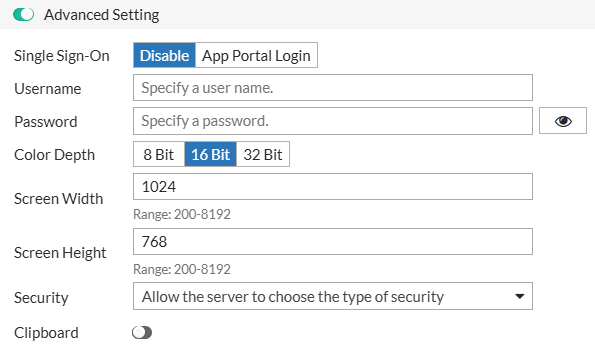

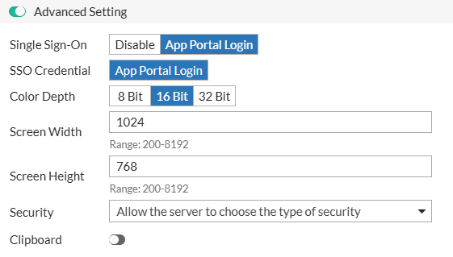

| Parameter             | Description                                                                                                                     |
|-----------------------|---------------------------------------------------------------------------------------------------------------------------------|
| Host                  | The IP address or hostname of the target Windows machine.                                                                       |
| Port                  | The port used for the RDP connection (default: 3389, range: 1-65535).                                                           |
| Description           | Optional description for the Web RDP bookmark.                                                                                  |
| **Advanced Settings** |                                                                                                                                 |
| **Single Sign-On**    | Determines whether Single Sign-On is used.                                                                                      |
|                       | - Disable (default) — manual login required. You will need to set the Username and Password for this login.                     |
|                       | - App Portal Login — uses portal credentials.                                                                                   |
| Username              | The username for authentication when Single Sign-On is disabled.                                                                |
| Password              | The password for authentication when Single Sign-On is disabled.                                                                |
| SSO Credential        | Appears when Single Sign-On is set to App Portal Login. The SSO Credential is set to use the App Portal Login by default.       |
| **Color Depth**       | Sets the color depth for the remote session.                                                                                    |
|                       | - 8 Bit                                                                                                                         |
|                       | - 16 Bit (Default)                                                                                                              |
|                       | - 32 Bit                                                                                                                        |
| Screen Width          | Specifies the width of the remote session display (default: 1024, range: 200-8192).                                             |
| Screen Height         | Specifies the height of the remote session display (default: 768, range: 200-8192).                                             |
| **Security**          | Defines the security protocol for the RDP session.                                                                              |
|                       | - Allow the server to choose the type of security – Uses the server's configured security settings. This is the default option. |
|                       | - Standard RDP security – Uses legacy RDP encryption.                                                                           |
|                       | - Network level authentication – Requires authentication before establishing the RDP session.                                   |
|                       | - TLS encryption – Uses Transport Layer Security (TLS) for encrypted communication.                                             |
| Clipboard             | Enables or disables clipboard sharing between the remote session and the local machine.                                         |

**Native RDP**

Native RDP allows users to launch a full remote desktop session using an installed RDP client. Unlike Web RDP, which runs in a browser, Native RDP opens the session in the system's RDP client, providing a more responsive experience and leveraging full client-side capabilities, including peripheral redirection, multiple monitor support, and enhanced performance.

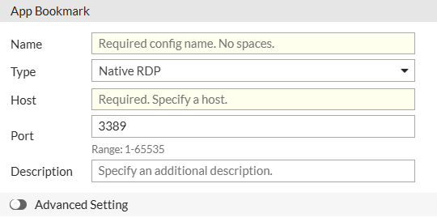
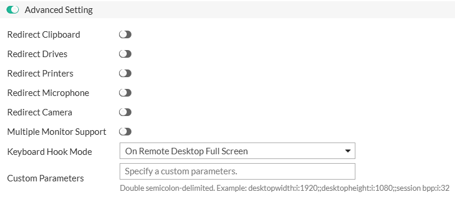

| Parameter                | Description                                                                                        |
|--------------------------|----------------------------------------------------------------------------------------------------|
| Host                     | The IP address or hostname of the target Windows machine.                                          |
| Port                     | The port used for the RDP connection (default: 3389, range: 1-65535).                              |
| Description              | 	Optional description for the Native RDP bookmark.                                                 |
| **Advanced Settings**    |                                                                                                    |
| Redirect Clipboard       | Allows clipboard sharing between the remote and local machine.                                     |
| Redirect Drives          | Enables access to local drives within the remote session.                                          |
| Redirect Printers        | Allows remote access to local printers.                                                            |
| Redirect Microphone      | Enables microphone redirection for remote audio input.                                             |
| Redirect Camera          | Enables camera redirection for video conferencing applications.                                    |
| Multiple Monitor Support | Allows the remote session to span multiple monitors.                                               |
| **Keyboard Hook Mode**   | Defines how keyboard shortcuts (e.g., Alt+Tab) are handled in the session.                         |
|                          | - On Local – Keyboard shortcuts remain on the local machine.                                       |
|                          | - On Remote Desktop Focus – Shortcuts apply to the remote session only when it is the active window. |
|                          | - On Remote Desktop Full Screen – Shortcuts apply to the remote session only when in full-screen mode. This is the default option.|
|                          | - On Remote App Focus – Shortcuts apply to the remote application window, not the full desktop session.|
| Custom Parameters        |Additional RDP client parameters for advanced configurations.|

**RemoteApp**

RemoteApp provides access to specific applications hosted on a remote Windows server without opening a full remote desktop session. Unlike Web RDP, which grants access to the entire remote desktop environment, RemoteApp launches only the selected application in a separate window, making it appear as if it is running locally on the user's device. This approach enhances security by restricting access to only approved applications and improves the user experience by integrating remote applications seamlessly into the local desktop environment.

**Note:** When publishing RemoteApp bookmarks
- Privacy and security settings, such as camera redirection, must be properly configured on the RDP session host.
- Redirect-printer support requires that the appropriate printer driver is installed on the RDP server before use.

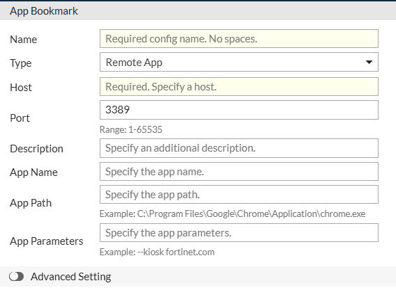

| Parameter                | Description |
|--------------------------|-|
| Host                     | The IP address or hostname of the RemoteApp server. |
| Port                     | The port used for the RemoteApp connection (default: 3389, range: 1-65535). |
| Description              | Optional description for the RemoteApp bookmark. |
| App Name                 | The display name of the RemoteApp application. |
| App Path                 | The full path to the executable of the RemoteApp. |
| App Parameters           | Additional command-line arguments for the RemoteApp. |
| **Advanced Settings**    | |
| Redirect Clipboard       | Allows clipboard sharing between the remote and local machine.|
| Redirect Drives          | Enables access to local drives within the RemoteApp session.|
| Redirect Printers        | Allows remote access to local printers.|
| Redirect Microphone      | Enables microphone redirection for remote audio input.|
| Redirect Camera          | Enables camera redirection for video conferencing applications.|
| Multiple Monitor Support | Allows the RemoteApp session to span multiple monitors.|
| **Keyboard Hook Mode**   | Defines how keyboard shortcuts (e.g., Alt+Tab) are handled in the session.|
|                          | - On Local – Keyboard shortcuts remain on the local machine. |
|                          | - On Remote Desktop Focus – Shortcuts apply to the remote session only when it is the active window. |
|                          | - On Remote Desktop Full Screen – Shortcuts apply to the remote session only when in full-screen mode. This is the default option. |
|                          | - On Remote App Focus – Shortcuts apply to the remote application window, not the full desktop session.|
| Custom Parameters        |Additional RDP client parameters for advanced configurations. |

**Web VNC**

Web VNC (Virtual Network Computing) enables web-based remote access to graphical desktops on Linux, macOS, and other VNC-compatible systems. It is commonly used for remote system administration and technical support.

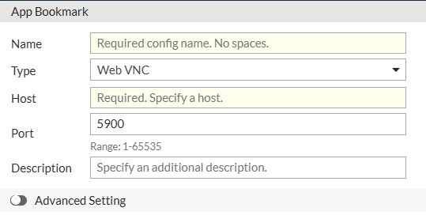
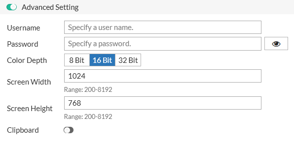

| Parameter             | Description                                                           |
|-----------------------|-----------------------------------------------------------------------|
| Host                  | The IP address or hostname of the VNC server.                         |
| Port                  | The port used for the VNC connection (default: 5900, range: 1-65535). |
| Description           | Optional description for the Web VNC bookmark.                        |
| **Advanced Settings** |                                                                       |
| Username              | The username for VNC authentication, if required.                     |
| Password              | The password for VNC authentication, if required.                     |
| **Color Depth**       | Sets the color depth for the VNC session.                             |
|                       | - 8 Bit                                                               |
|                       | - 16 Bit (Default)                                                    |
|                       | - 32 Bit                                                              |
| Screen Width          |Specifies the width of the VNC session display. The default value is 1024, with a valid range of 200-8192.|
| Screen Height         |Specifies the height of the VNC session display. The default value is 768, with a valid range of 200-8192.|
| Clipboard             |Enables or disables clipboard sharing between the remote and local system.|

**Web SSH**

Web SSH (Secure Shell) provides secure, web-based command-line access to remote Linux and Unix systems. It is commonly used for server administration and troubleshooting.

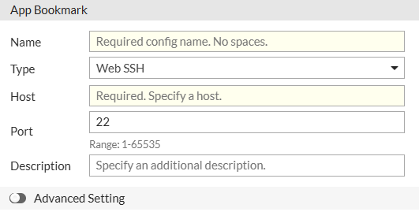
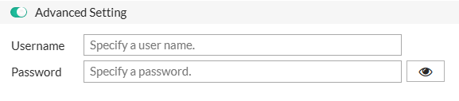

| Parameter             | Description  |
|-----------------------|--------------|
| Host                  |The IP address or hostname of the SSH server.|
| Port                  |The port used for the SSH connection (default: 22, range: 1-65535).|
| Description           |Optional description for the Web SSH bookmark.|
| **Advanced Settings** ||
| Username              |The SSH login username.|
| Password              |The SSH login password (if password authentication is used).|

**Web TELNET**

Web Telnet provides browser-based access to network devices and legacy systems that use the Telnet protocol. It is commonly used for managing routers, switches, and older mainframe systems.

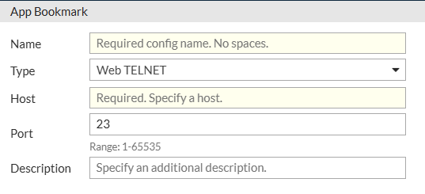

|Parameter|Description|
|---------|-----------|
|Host|The IP address or hostname of the Telnet server.|
|Port|The port used for the Telnet connection (default: 23, range: 1-65535).|
|Description|Optional description for the Web Telnet bookmark.|

