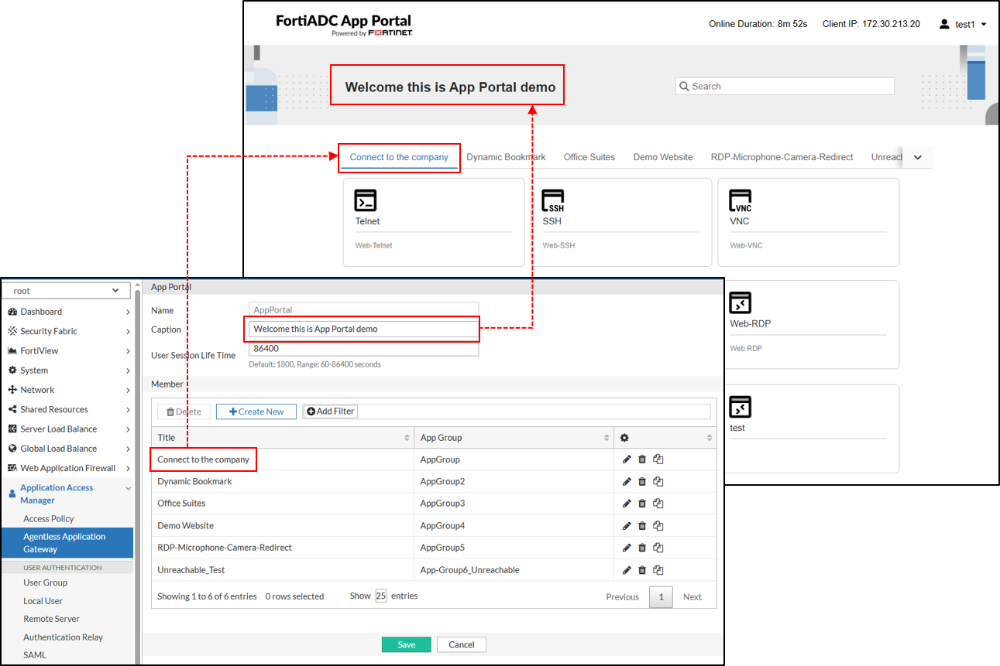
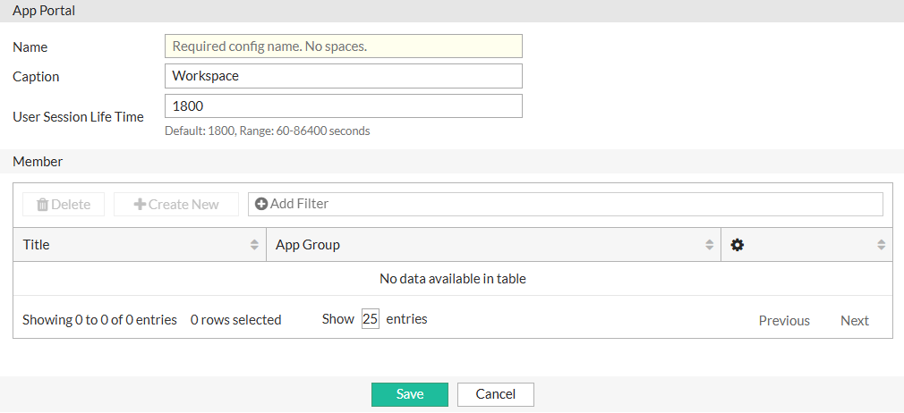
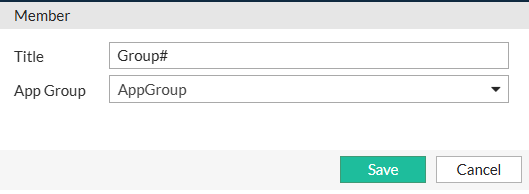

### Configuring an App Portal

An App Portal in FortiADC serves as a centralized, browser-based interface that allows end-users to securely access applications published through the Agentless Application Gateway (AAG). It aggregates applications from one or more App Groups and integrates with the configured Access Policy to enforce authentication and authorization based on user identity and group membership.

From the App Portal configuration page, administrators can customize the portal’s appearance and structure. A Caption can be entered to display descriptive text in the top banner of the portal interface. App Group configurations are added as Members of the App Portal, with each Member appearing as a dedicated tab within the portal. The Title field within each Member configuration allows administrators to define the label that appears on the corresponding tab. Each tab provides access to the set of application bookmarks defined in its associated App Group.

**Before you begin:**

Ensure that you have already configured the necessary App Groups containing the application bookmarks that will be made available to end-users through the App Portal. For details, see [Configuring an App Group](https://docs.fortinet.com/document/fortiadc/8.0.0/administration-guide/539658/configuring-an-app-group).

**To configure an App Portal:**
1. Navigate to Application Access Manager > Agentless Application Gateway.
The configuration page displays the App Portal tab.
2. Click Create New to display the configuration editor.

3. In the Name field, specify a unique name for the App Portal configuration object. Valid characters are A-Z, a-z, 0-9, _, and -. No space is allowed.
4. In the Caption field, enter the text you want to display in the top banner of the App Portal. This can be used to provide a welcome message, organization name, or other identifying information for users.
5. In the User Session Life Time field, specify the maximum duration (in seconds) that a user session can remain idle before automatic logout. The default is 1800 seconds. Valid values range from 60 to 86400 seconds.
6. Click Save. Once the App Portal is created, the Member section becomes configurable.
7. Under the Member section, click Create New to display the configuration editor.

8. In the Title field, specify the label that will appear as the tab header for the associated App Group within the App Portal interface.
9. In the App Group field, select a predefined App Group configuration from the drop-down list.
10. Click Save to apply the configuration and close the App Portal Member dialog. You can add up to 32 members to a single App Portal.
11. Click Save to apply all changes to the App Portal and its member settings.

**Note:** Each VDOM supports up to 1024 App Groups, but a single App Portal can be associated with a maximum of 32 App Groups.