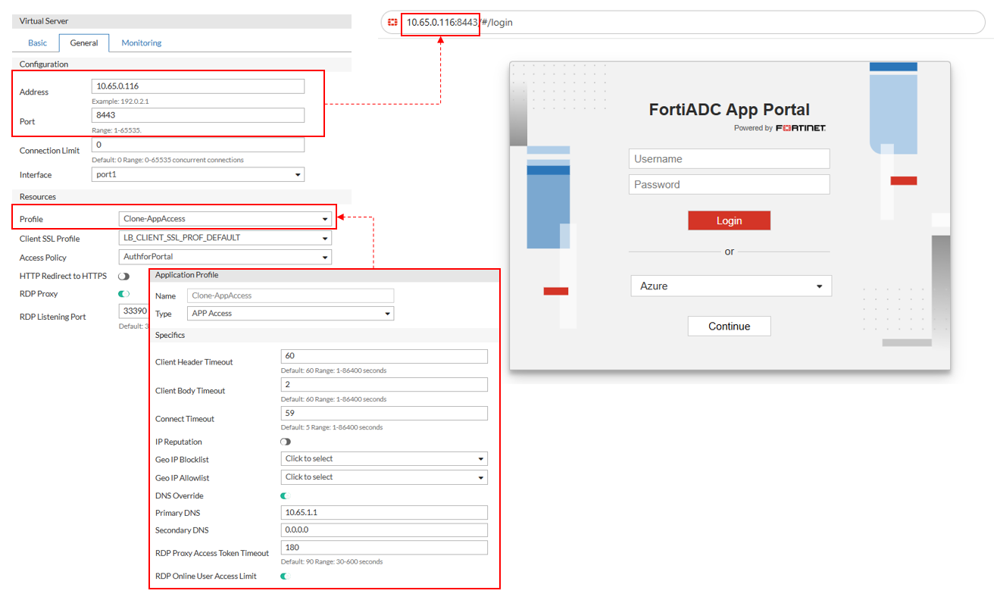
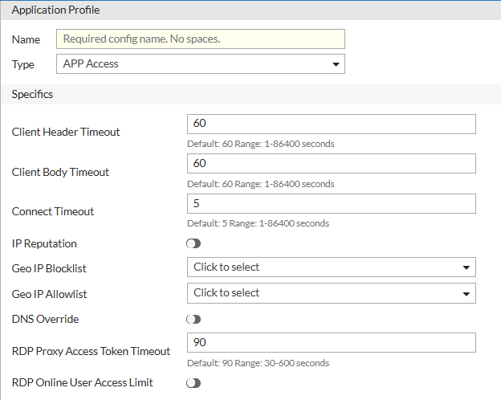

### Deploying the AAG Virtual Server

After configuring the App Portal and defining App Groups, the next step in deploying the Agentless Application Gateway (AAG) is to create a Layer 7 Virtual Server. This server acts as the central access point for authenticated users, routing traffic through the App Portal and enforcing security policies through access control.

FortiADC introduces a new application profile type—APP Access—to support agentless access use cases. This profile exposes AAG-specific parameters such as RDP Proxy Access Token Timeout and RDP Online User Access Limit. When bound to a Virtual Server, it enables AAG-specific capabilities, including optional RDP proxy functionality.

**Configuring the APP Access profile**

Before deploying the Virtual Server, an Application Profile of type APP Access must be configured. This profile defines protocol timeouts, DNS behavior, IP-based filtering, and RDP-specific limits for agentless access.

You can create a custom profile or use the predefined LB_PROF_APP_ACCESS profile.

**To configure an APP Access Profile:**
1. Navigate to Server Load Balance > Application Resources. The configuration page displays the Application Profile tab.
2. Click Create New to display the configuration editor.
3. In the Name field, specify a unique name for the custom Application Profile configuration object. Valid characters are A-Z, a-z, 0-9, _, and -. No space is allowed. Once saved, the name of a Application Profile configuration cannot be changed.
4. From the Type field, select APP Access.
5. Configure the settings for the APP Access profile type.
6. Click Save to save the configuration.

|Parameter| Description                                                                                                                                                                                                                                                                                             |
|---------|---------------------------------------------------------------------------------------------------------------------------------------------------------------------------------------------------------------------------------------------------------------------------------------------------------|
|Client Header Timeout| Maximum time (in seconds) FortiADC waits to receive the complete HTTP headers from the client. The default value is 60 seconds, and the valid range is 1-86400 seconds.                                                                                                                                 |
|Client Body Timeout| Maximum time (in seconds) FortiADC waits to receive the complete HTTP body after headers are received. The default value is 60 seconds, and the valid range is 1-86400 seconds.                                                                                                                         |
|Connect Timeout| 	Maximum time (in seconds) to wait for a connection attempt to a backend server to succeed. The default value is 5 seconds, and the valid range is 1-86400 seconds.                                                                                                                                     |
|IP Reputation| Enable to apply FortiGuard’s IP reputation service to block or allow traffic based on IP threat scores. See [Managing IP Reputation policy settings](https://docs.fortinet.com/document/fortiadc/8.0.0/administration-guide/675398/managing-ip-reputation-policy-settings#security_2079013532_1121482). |
|Geo IP Blocklist| Select a Geo IP block list configuration object to deny access from specific countries or regions. See [Using the Geo IP block list](https://docs.fortinet.com/document/fortiadc/8.0.0/administration-guide/016105/using-the-geo-ip-block-list#security_2079013532_1150147).                            |
|Geo IP Allowlist| Select a Geo IP allowlist configuration object to explicitly permit access from specific regions. See [Using the Geo IP allowlist](https://docs.fortinet.com/document/fortiadc/8.0.0/administration-guide/788718/geo_allowlist.htm).                                                                                                                                                                   |
|DNS Override| Enable to override the system DNS settings with custom DNS servers.                                                                                                                                                                                                                                     |
|Primary DNS| The Primary DNS option is available if DNS Override is enabled. Specify the IP address of the primary DNS server.                                                                                                                                                                                       |
|Secondary DNS| The Secondary DNS option is available if DNS Override is enabled. Specify the IP address of the secondary DNS server.                                                                                                                                                                                   |
|RDP Proxy Access Token Timeout| Defines how long the RDP access token remains valid in seconds. The default value is 90 seconds, and the valid range is 30-600 seconds.                                                                                                                                                                 |
|RDP Online User Access Limit| Enable to limit the number of concurrent RDP sessions per user through the App Portal.                                                                                                                                                                                                                  |

Predefined APP Access Profile: LB_PROF_APP_ACCESS

|Parameter|Default Value|
|---------|-------------|
|Client Header Timeout|60|
|Client Body Timeout|60|
|Connect Timeout|5|
|IP Reputation|Disabled|
|Geo IP Blocklist|None|
|Geo IP Allowlist|None|
|DNS Override|Disabled|
|RDP Proxy Access Token Timeout|90|
|RDP Online User Access Limit|Disabled|

**Configuring the Virtual Server for AAG**

Once the APP Access profile and Access Policy are in place, configure the Virtual Server that delivers the App Portal functionality.

**To configure the Virtual Server:**

1. Navigate to Server Load Balance > Virtual Server. The configuration page displays the Virtual Server tab.
2. Click Create New > Advanced Mode to display the configuration editor. 
3. Configure the following key Virtual Server settings:
   - In the Basic tab, select the virtual server Type as Layer 7. 
   - In the General tab, configure the following Configuration settings:
     - Address — Specify the IP address that the virtual server will bind to. 
     - Port — Enter the listening port for user connections (e.g., 443 for HTTPS). 
     - Connection Limit — Optionally, define a maximum number of concurrent connections. 
     - Interface — Select the network interface on which the virtual server will listen.
   - In the General tab, configure the following Resources settings:
     - Profile — Select a predefined or user-defined APP Access profile. This enables agentless access features and exposes AAG-specific settings. The configuration options will adjust to what is applicable to this profile type. For more information, see [Configuring the APP Access profile](https://docs.fortinet.com/document/fortiadc/8.0.0/administration-guide/788718/deploying-the-aag-virtual-server#Configuring_app_access). 
     - Access Policy — Attach the corresponding Access Policy that enforces authentication and authorization rules for App Portal access. 
     - RDP Proxy — If RDP access is required, enable the RDP Proxy option. This activates RDP-specific settings configured in the APP Access profile. 
     - RDP Listening Port — Defines the TCP port on which FortiADC listens for inbound RDP client connections. This setting is only visible when RDP Proxy is enabled and applies specifically to Native RDP and RemoteApp bookmarks. The default port is 3389, and the valid range is 1–65535.
4. Click Save.

The configured Virtual Server will now route users through the App Portal, enabling secure, agentless access to internal web and desktop applications.

**Note:** The visibility of Native RDP and RemoteApp bookmarks in the App Portal depends on whether RDP Proxy is enabled on the associated Virtual Server.

By default, RDP Proxy is disabled, and any configured Native RDP or RemoteApp bookmarks will not appear in the App Portal until it is enabled.

To ensure these application types are accessible to users, enable RDP Proxy in the Virtual Server configuration.