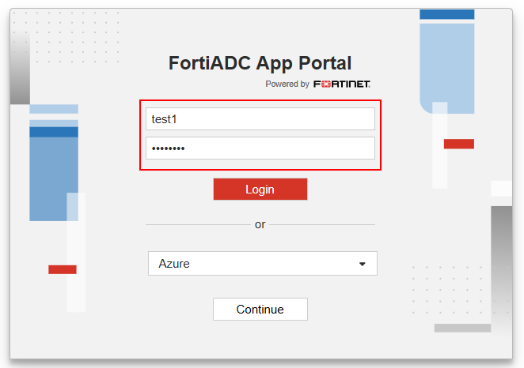
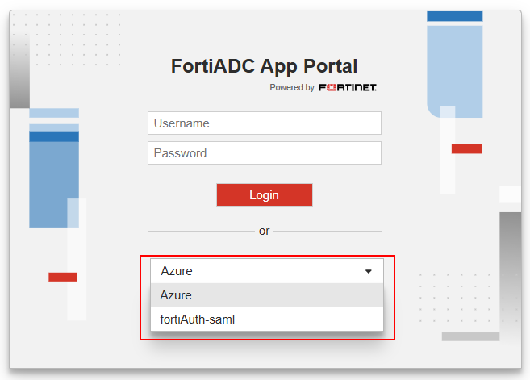
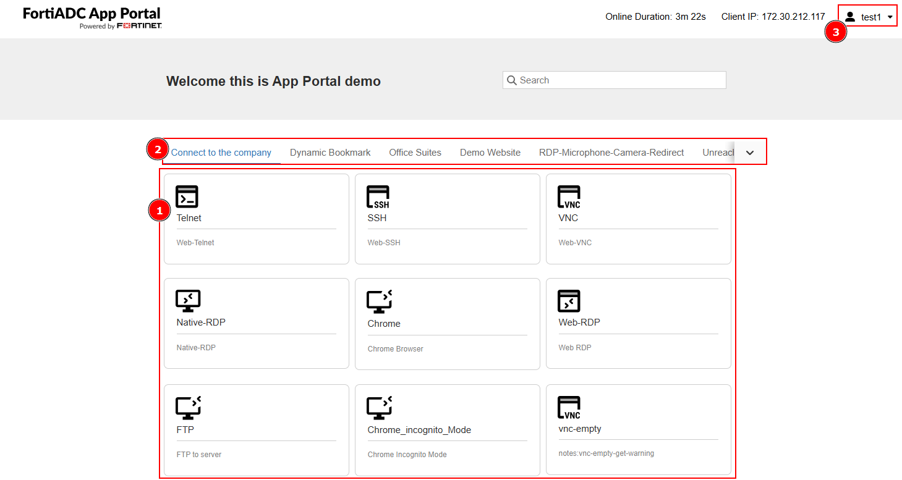

### Accessing the AAG App Portal

After setting up the App Portal and deploying the Agentless Application Gateway (AAG) Virtual Server with the appropriate Access Policy, users can securely log in through their browser to access internal enterprise applications. The AAG App Portal serves as a centralized interface for launching web, desktop, and terminal-based resources—no client agents required.

This section provides an overview of the end-user experience, including authentication flow, portal navigation, application access, and session handling.

**Topics Covered:**

- Signing In and Session Management – Authentication methods and session behavior.
- Exploring the AAG Portal Interface – Layout and navigation overview.
- Launching Applications – Accessing applications such as RDP, SSH, and web apps.
- Managing Sessions and Logging Out – Viewing active sessions and secure logout.

**Signing In and Session Management**

Users authenticate based on the method defined in the Access Policy bound to the AAG Virtual Server. FortiADC supports a range of authentication mechanisms, including:
- Local authentication – Users enter credentials defined on FortiADC.
- Remote authentication – Users authenticate via LDAP, RADIUS, or SAML-based identity providers.

Once authenticated, FortiADC initializes a user session, enforces idle timeouts, and supports reauthentication if required by policy.

**Exploring the AAG Portal Interface**

Upon successful login, users are presented with the AAG App Portal interface. The interface is browser-based, intuitive, and dynamically reflects the user's access permissions.

The portal includes:
- Application Tiles – Icons representing RDP, SSH, VNC, or web-based resources.
- App Grouping – Applications grouped by assigned App Group.
- User Information – Includes user information and option to logout.

**Launching Applications**

Users can launch applications directly from the portal without requiring any local agents. Supported connection types include:
- Web Applications – Opens in a new tab or embedded frame.
- Remote Desktop (RDP) – Rendered using HTML5 viewer via FortiADC proxy.
- SSH / Telnet / VNC – Browser-based terminal access.

RDP connections honor the settings configured in the APP Access profile:
- RDP Proxy Access Token Timeout – Controls how long a token remains valid.
- RDP Online User Access Limit – Limits the number of concurrent RDP sessions per user.

**Managing Sessions and Logging Out**

Users can track their active sessions within the portal and safely log out once done. FortiADC enforces session cleanup and authentication token removal on logout.

Session-related capabilities:
- Switching Between Applications – Seamless navigation without reauthentication.
- Manual Logout – Ends session and removes tokens.

