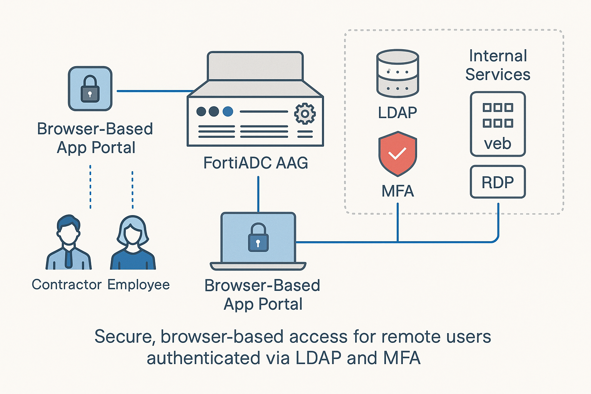

### AAG Implementation Scenarios

FortiADC’s Agentless Application Gateway (AAG) is designed to provide secure, browser-based access to internal applications without requiring client-side agents or VPNs. AAG is especially effective in environments where users access sensitive resources from remote locations, unmanaged devices, or hybrid cloud infrastructures.

This section outlines three practical deployment scenarios where FortiADC AAG can be applied to meet specific organizational needs:

- Secure Remote Access for Distributed Workforces
- Unified Access to Hybrid Cloud Applications
- Secure, Clientless RDP Access for Remote and BYOD Users

Each scenario presents specific challenges, followed by a technical walkthrough of the AAG solution and the resulting benefits.

Scenario 1: Secure Remote Access for Distributed Workforces

The Challenge:

Organizations need to grant secure, browser-based access to internal applications for remote employees and contractors—without relying on VPN clients or exposing internal systems to unmanaged endpoints.

The AAG Solution:

FortiADC AAG enables secure, clientless access to internal web, SSH, and RDP services via the browser-based App Portal. A Layer 7 Virtual Server acts as the centralized access point, enforcing user authentication and session handling through Access Policies. APP Access profiles and RDP Proxy support RDP for session delivery, while authentication is handled using LDAP, RADIUS, or SAML-based identity providers. Application access is controlled through App Groups and bookmarks assigned to the user’s portal session.

Outcome:

- Simplified access from unmanaged or non-compliant devices
- Reduced VPN complexity and administrative overhead
- Centralized authentication and session-level visibility

Scenario 2: Unified Access to Hybrid Cloud Applications

The Challenge:

Enterprises operating in hybrid environments struggle to provide secure, seamless access to both cloud and on-premises applications while maintaining consistent identity and policy enforcement.

AAG Solution:

FortiADC AAG centralizes access across environments using multiple Virtual Servers grouped by application location. Each is configured with APP Access profiles and Access Policies tied to federated authentication methods such as SAML. Unified access control policies ensure identity-aware enforcement and consistent auditing.

Outcome:

- Single point of access for hybrid app environments
- Reduced operational complexity via centralized policy management
- Strengthened compliance through unified logging and identity-based controls

Scenario 3: Secure, Clientless RDP Access for Remote and BYOD Users

The Challenge:

Organizations need to provide secure remote desktop access for users on BYOD (Bring Your Own Device) or unmanaged endpoints—without relying on installed RDP clients or introducing the complexity of VPN deployments.

AAG Solution:

FortiADC’s Agentless Application Gateway (AAG) enables HTML5-based RDP access directly through a web browser. A Layer 7 Virtual Server configured with an APP Access profile and RDP Proxy handles authentication and session forwarding. Access Policies authenticate users against LDAP or RADIUS, and the APP Access profile enforces session constraints, such as RDP access token timeouts and user session limits. Optional controls—such as clipboard restriction and file transfer blocking—can be configured on the backend RDP server for enhanced endpoint security.

Outcome:

- Fully browser-based RDP access from unmanaged devices
- Reduced client and VPN management overhead
- Secure session handling with enforced timeouts and session visibility