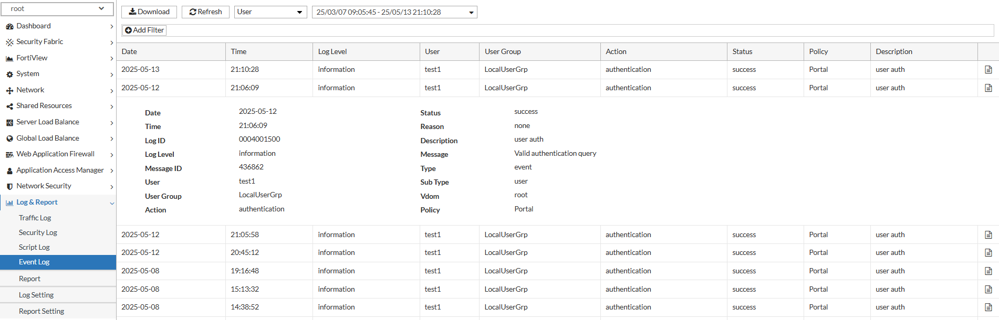
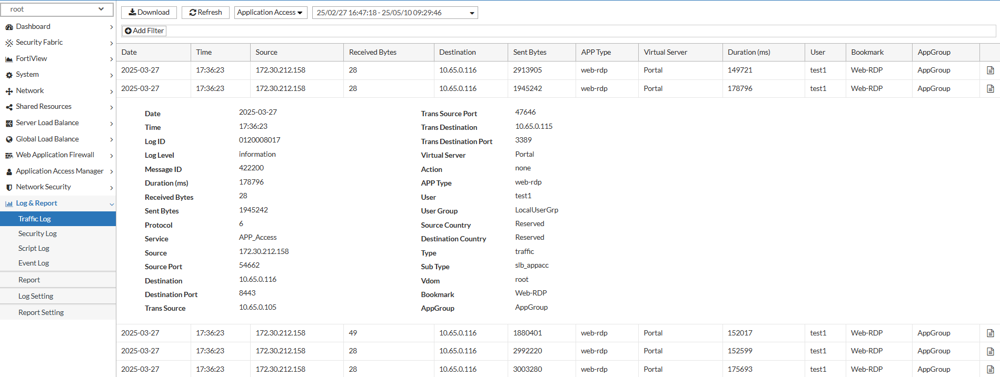

### AAG Debugging and Troubleshooting

FortiADC provides both GUI and CLI-based diagnostic tools to monitor and troubleshoot Agentless Application Gateway (AAG) activity. These tools allow administrators to inspect authentication events, session status, traffic usage, and connection behavior in real time.

This information is also available in the FortiADC 8.0.0 Administration Guide and CLI Reference:

- [AAG Debugging and Troubleshooting](https://docs.fortinet.com/document/fortiadc/8.0.0/administration-guide/694701)
- [AAG User Sessions](https://docs.fortinet.com/document/fortiadc/8.0.0/administration-guide/545501)
- [diagnose app-publish](https://docs.fortinet.com/document/fortiadc/8.0.0/cli-reference/536628)
- [diagnose debug module fnginx](https://docs.fortinet.com/document/fortiadc/8.0.0/cli-reference/114820/diagnose-debug-module-fnginx)

**GUI-Based Monitoring and Logging**

FortiView – User Session

Navigate to FortiView > User Session to view real-time information about users currently authenticated through the AAG App Portal.

The table displays the following fields:

- VS – Virtual Server name handling the session
- Session ID – Unique identifier for the user session
- User ID – Internal user identifier
- User Name – Authenticated username
- Source IP – Origin IP address of the client
- IDP Rule – Identity provider rule that applied
- User Group – Assigned group membership
- Duration (s) – Time the session has been active
- Expire (s) – Remaining time before session expiration

This dashboard is useful for tracking session state, identifying active users, and confirming authentication success.

**Event Logs – Authentication Activity**

To review authentication behavior and diagnose login issues, navigate to Log & Report > Event Log and filter by User.

Each log entry provides detailed contextual information, including:

- Date – The date the event occurred
- Time – The timestamp of the event
- Log Level – Severity or verbosity of the log (e.g., notice, warning)
- User – Username of the individual attempting access
- User Group – Group membership associated with the user
- Action – Type of authentication event (e.g., login, logout, failure)
- Status – Result of the event (e.g., success, failed)
- Reason – High-level reason code for the event (e.g., invalid credentials)
- Description – Summary of the action performed
- Message – Detailed message or explanation from the system
- Vdom – Virtual domain where the event occurred
- Policy – Access Policy name that governed the authentication flow

Use this log view to validate user authentication behavior, troubleshoot policy misconfigurations, or verify enforcement across user groups and virtual domains.

**Traffic Logs – Application Access**

Navigate to Log & Report > Traffic Log and filter by Application Access to analyze usage and connection details for all applications accessed through the AAG App Portal.

Each entry includes:

- Date, Time, Log Level
- Duration (ms)
- Received Bytes, Sent Bytes
- Protocol, Service
- Source, Source Port
- Destination, Destination Port
- Translated Source/Destination Port
- Virtual Server
- Action (accept, deny)
- APP Type – Application type (e.g., RDP, SSH)
- User Group
- Source Country, Destination Country
- Bookmark – The application bookmark used
- AppGroup – The App Group containing the bookmark

This log provides visibility into user activity, bandwidth usage, and resource access patterns.

**CLI-Based Diagnostic Tools**

App-Publish Diagnostic Commands

Use the *diagnose app-publish* command set to inspect AAG configuration and manage user sessions directly from the CLI:

|Command|Description|
|-------|-----------|
|show-config|Displays the current AAG configuration, including App Portals, App Groups, and bookmarks.|
|show-user|Lists all currently authenticated AAG users and session details.|
|show-connection|Displays active application connections established through the AAG portal (e.g., RDP, SSH sessions).|
|kickoff-user|Terminates the session of a specific AAG user. Useful for forced logout or session resets.|
|clear-user|Clears all tracked session state for a specified user.|
|clear-connection|Terminates all AAG application connections for a specific user or session.|

**Example:**

**Module-Level Debug Logging**

To enable verbose logging for the AAG module (app-publish), use the following command to view runtime behavior and debug issues:

*diagnose debug module fnginx app-publish*

This command provides backend insight into:

- Portal rendering behavior
- Bookmark resolution and visibility issues
- Session negotiation
- Authentication handoff and result mapping
- Application proxy session establishment and teardown

Enable debug output when troubleshooting issues related to user login failures, bookmark rendering problems, or connection errors.

**Example:**

