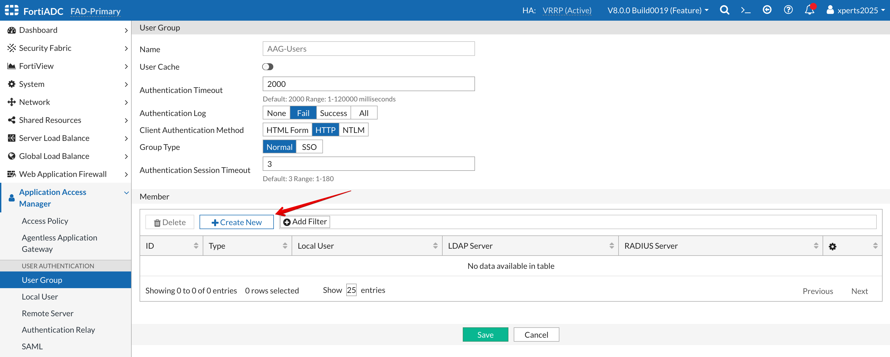

### AAG Quick Lab Guide
A quick guide on how to set up the Application Access Gateway using a local user account.

**Workflow:**
1. Create a local user
2. Create a user group
3. Add the local user to the user group
4. Configure an Application Group
5. Configure the Application Portal
6. Configure the Application Access Policy
7. Configure the Application Access Virtual Server
8. Test

**Configure a Local User**
- Go to **Application Access Manager > Local User**
- Click **+Create New**

- Name: **user1**
- Password: **user1**
- **SAVE**

**Configure a User Group**
- Go to **Application Access Manager > User Group**
- Click **+Create New**
- Group Name: **AAG-Users** 
- **SAVE**
- Click **+Create New**

- Type: **Local**
- Local User: **user1**
- **SAVE**

**Configure the AAG Application Group**
- Go to **Application Access Manager > Agentless Application Gateway > App Group**
- Click **+Create New**

- Name: **AAG-App-Group**
- **SAVE**
- Click **+Create New**

- Name: **DVWA-SSH**
- Type: **Web-SSH**
- Host: **10.1.3.4**
- Port: **22**
- Set the **Advanced Setting** flag to **ON**
- Username: xperts2025
- Password: *********
- **SAVE**
- **SAVE**

**Configure the AAG Application Portal**
- Go to **Application Access Manager > Agentless Application Gateway > App Portal**
- Click **+Create New**

- Name: **AAG-App-Portal**
- **SAVE**
- Click **+Create New**

- Title: **AAG-App-Portal**
- App Group: **AAG-App-Group**
- **SAVE**
- **SAVE**

**Configure the AAG Application Access Policy**
- Go to **Application Access Manager > Agentless Application Gateway > Access Policy**
- Click **+Create New**

- Name: **AAG-Access-Policy**
- Set the **"App Portal Access"** ON
- **SAVE**

- Click **+Create New**

- Name: **AAG-Portal-Users**
- User Group: **AAG-Users**
- App Portal: **AAG-App-Portal**
- **SAVE**
- **SAVE**

**Configure a Virtual Server for the AAG**
- Go to **Server Load Balance > Virtual Server**
- Click **+Create New**

- Name: **AAG**
- Type: **Layer 7**

**Note:** There is no need to save yet.  We will go to the **General** TAB and the **Monitoring** TAB then save the whole thing.

- Click on the **General** Tab

- Address: **10.1.2.100**
- Port: **9443**
- Interface: **Port1**

**Important:** The Profile needs to be an AAG Profile.

- Profile: **LB_PROFILE_APP_ACCESS**
- Access Policy: **AAG-Access-Policy**

No need to save yet.

- Click on the **Monitoring** Tab

- Toggle the **Traffic Log** flag to ON
- **SAVE**

**Note:** Traffic logging should be used mainly for debugging; traffic logging will consume extensive memory and CPU resources. Please disable traffic logging after debugging is complete.

Go to **FortiView > Logical Topology**

You should see your Application Access Gateway.

**Test AAG Access**
- Log into the Client
- Open Firefox
- Go to https://10.1.1.100:9443

- Username: **user1**
- Password: **user1**

You should see your **Application App Group**

Click the **DVWA-SSH** App Group

You should have access to the DVWA server via SSH.

