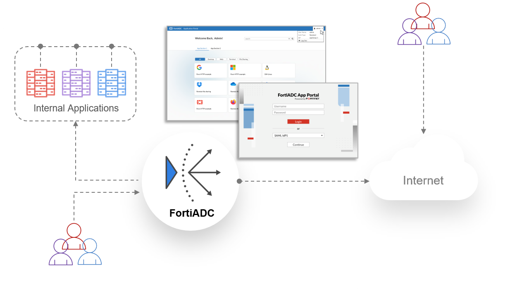

### Application Access Gateway (AAG)

The Agentless Application Gateway (AAG) in FortiADC provides secure, seamless remote access to enterprise applications and critical resources without requiring agent installation on endpoints or backend servers. Acting as a reverse proxy, AAG publishes a web-based authentication portal that enables clientless access to Remote Desktop Protocol (RDP), Virtual Network Computing (VNC), Secure Shell (SSH), Telnet, and web applications.

Authentication to the AAG App Portal is enforced via Access Policies. These policies define the accepted authentication methods—including Local User, LDAP, RADIUS, or SAML—and determine session behavior such as idle timeout and reauthentication. Application visibility is controlled by App Portals and App Groups.

**Key Features and Benefits**

AAG in FortiADC delivers secure and scalable remote access with the following capabilities:
- Agentless Access – Eliminates the need for client-side agents, reducing endpoint dependency and administrative burden.
- Federated Authentication Support – Supports SAML 2.0-based authentication using providers like Microsoft Entra ID and FortiAuthenticator.
- Simplified Deployment – Requires no software installation, enabling rapid implementation in secure environments.
- Real-Time Monitoring – Tracks user sessions and access logs for compliance and auditing.
- Application-Layer Security Controls – Enforces IP reputation filtering and geolocation restrictions through the Application Profile attached to the AAG Virtual Server.

### Technical Overview
**Traditional vs. Agentless Application Access**

Traditional remote access solutions often require software agents installed on client devices or backend systems to enforce authentication and security policies. This introduces compatibility constraints, maintenance overhead, and security risks associated with unmanaged endpoints.

FortiADC’s Agentless Application Gateway (AAG) eliminates these dependencies by acting as a reverse proxy, terminating client sessions at the gateway and forwarding traffic to backend resources based on authentication and policy enforcement mechanisms.

### Authentication Flow and Identity Integration

**AAG supports the following authentication workflow:**

1. The user accesses the AAG App Portal via browser. 
2. FortiADC evaluates the Access Policy and enforces the configured authentication method by: 
   - Validating credentials against Local User, LDAP, or RADIUS servers. 
   - Redirecting to a SAML 2.0 Identity Provider (e.g., FortiAuthenticator, Microsoft Entra ID) for federated login. 
3. Upon successful authentication, FortiADC grants access to the App Portal associated with the user's session.

The user can view and launch their assigned application bookmarks for services such as RDP, SSH, VNC, Telnet, and web apps.

**Multi-factor authentication (MFA), OAuth, and AD FS Proxy are not currently supported for AAG access.**

**Architecture and Components**

AAG operates at Layer 7 as an SSL-terminating reverse proxy, inspecting client requests, performing authentication, and forwarding traffic to internal resources based on predefined access policies.
- Client-SSL termination ensures encrypted client communication while enabling inspection and policy enforcement at the gateway.
- Backend authentication passthrough allows seamless integration with existing enterprise identity providers.
- Session persistence mechanisms maintain continuity for authenticated sessions.
- Real-time logging and monitoring track user activity and enforce compliance requirements.

**Control Plane Components**

The control plane in AAG manages authentication, policy enforcement, session handling, and application publishing. It acts as the centralized management layer, integrating with identity providers (IdPs) and enforcing security policies based on user roles, device attributes, and contextual data. By decoupling authentication and access control from the data plane, the control plane ensures efficient session management while maintaining high security.

App Portal Virtual Server (L7 Reverse Proxy)

- Handles user login, authentication enforcement, and session initiation.
- Performs SSL termination and supports IPv4/IPv6.
- Integrates with Access Policies and federated identity providers.

Authentication and Authorization Services

- Supports local and remote identity verification through Access Policies.
- Compatible with LDAP, RADIUS, and SAML IdPs (e.g., FortiAuthenticator, Microsoft Entra ID).

Application Portal and Bookmark Management

- Hosts a centralized, web-based portal for users to access published applications.
-Supports dynamic bookmarks mapped via LDAP attributes for personalized access.

Data Plane Components

The data plane in AAG is responsible for handling user traffic, forwarding requests to backend applications, and enforcing security measures in real time. It processes encrypted sessions, inspects traffic for potential threats, and applies policy-based access controls. By managing the actual data exchange between users and applications, the data plane ensures that only authorized requests reach enterprise resources while maintaining performance and security.

Application Publishing and Session Management

- Delivers HTML5-based clientless access for RDP, VNC, SSH, and Telnet.
- Supports direct RDP and RemoteApp connections for seamless interaction.
- Enforces RDP attribute-based policies to regulate session parameters.

Access Control and Security Enforcement

- Enforces IP Reputation, Geo IP Blocklist, and Allowlist through Application Profiles.
-Logs session details and access records for diagnostics and compliance.

This architecture ensures a scalable, policy-driven remote access solution while maintaining strong security controls.

**AAG Configuration Components in FortiADC**

The Agentless Application Gateway (AAG) configuration in FortiADC consists of two primary components: App Groups and App Portals. These components define how applications are published and accessed by authenticated users.

App Portal Configuration

An App Portal defines the web-based authentication interface where users log in and access applications. Each App Portal is associated with an App Group, controlling which applications are available to authenticated users.

- Defines the authentication portal for end users.
- Associates App Groups to control user access.
- Supports TLS encryption for secure access.

For details, see [Configuring an App Portal](https://docs.fortinet.com/document/fortiadc/8.0.0/administration-guide/422996/configuring-an-app-portal).

**Supported Application Types in FortiADC AAG:**
- Web RDP – Provides full desktop access via Remote Desktop Protocol (RDP) through an HTML5 browser session. No RDP client is required on the endpoint.
- Native RDP – Enables traditional RDP access using the native RDP client installed on the user's device. Requires endpoint support for Microsoft RDP.
- RemoteApp – Launches individual Windows applications published via Remote Desktop Services, rather than a full desktop session.
- Web VNC – Offers browser-based access to VNC-enabled systems for remote control of graphical desktops.
- Web SSH – Delivers secure command-line access to Linux and Unix systems through a browser-based SSH terminal.
- Web Telnet – Enables text-based terminal sessions to legacy devices or servers using the Telnet protocol, directly within the browser.

**Capacity Guidelines (Per VDOM)**

To ensure efficient performance and prevent configuration errors, observe the following capacity limits per VDOM:

|Item|Maximum Count|
|----|-------------|
|App Portals|1024|
|App Groups|1024|
|App Groups per App Protal (sections)|32|
|Bookmarks per App Group|256|
|IdPs per Access Policy|8|

Workflow for Configuring AAG in FortiADC

Step 1: Configure User Authentication

Select the appropriate authentication method based on deployment requirements.
- For local authentication, create a Local User and assign it to a User Group.
- For remote authentication, configure a Remote Server (e.g., LDAP, RADIUS) and create a User Group.
-For SAML authentication, set up SAML IDP and SAML SP for federated authentication.

For recommendations, see [Selecting the Optimal Authentication Method for AAG](https://docs.fortinet.com/document/fortiadc/8.0.0/administration-guide/819587/selecting-the-optimal-authentication-method-for-aag).

Step 2: Configure the Agentless Application Gateway (AAG)
- Create an App Group and add relevant Application Bookmarks. For details, see Configuring an App Group.
-Configure an App Portal and associate it with the App Group. For details, see Configuring an App Portal.

Step 3: Configure Access Policies and Authorization
Apply policies to enforce authentication and authorization.
- Define an Access Policy that enforces the selected authentication method. For details, see Access Policy.
- Assign User Groups to the App Portal based on access requirements. For details, see Configuring user groups.

Step 4: Configure Virtual Server for Application Access

Set up application delivery through a virtual server.
- Use the APP Access Application Profile to configure IP Reputation, Geo IP Blocklist, and Geo IP Allowlist.
- Deploy a Layer 7 Virtual Server and assign the APP Access profile, Access Policy, and enable RDP Proxy (if required).
- Associate the App Portal with the virtual server.

For details, see [Deploying the AAG Virtual Server](https://docs.fortinet.com/document/fortiadc/8.0.0/administration-guide/788718/deploying-the-aag-virtual-server).

